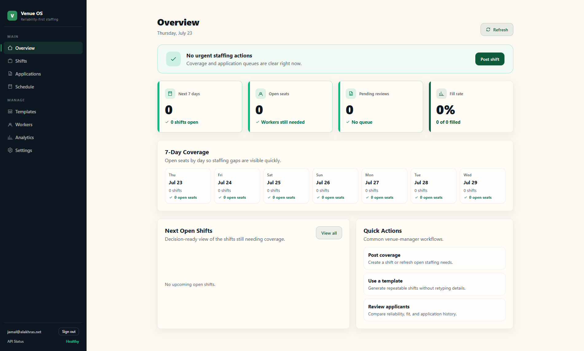

# Event Staffing Platform

A reliability-first event staffing platform: venue managers post shifts, workers apply, and the system tracks bookings, reliability scores, and no-shows through a domain state machine. FastAPI and PostgreSQL backend, a React web dashboard, and an Expo mobile worker app.

*The React web dashboard (venue-manager view). The mobile worker app and the other six pages — Shifts, Applications, Workers, Schedule, Analytics, Settings — share the same audited API.*

## Architecture

- **Hexagonal / ports and adapters.** Domain logic — the booking aggregate and shift state machine — is isolated behind repository ports. Adapters are swappable: in-memory for fast tests, SQLAlchemy over PostgreSQL for production.
- **PostgreSQL is the source of truth.** CI runs lightweight tests against in-memory fakes and the complete endpoint, transaction, locking, and query suite against PostgreSQL with migrations applied from zero.
- **Correct under concurrency.** Multi-worker shift capacity under concurrent approvals is handled with row locks inside a transaction, so a shift can never be oversubscribed by a race.
- **Production guardrails.** Startup refuses to boot with a default or short JWT secret, or with dev-mode enabled outside a development environment.

## What is built

- Domain state machine and booking aggregate; FastAPI lifecycle endpoints with OpenAPI schemas.
- JWT authentication with registration, login and token revocation; operator invite gating; email verification.
- Shifts, applications, operator approvals, worker profiles, reliability scoring, and an automated no-show sweep.
- Multi-worker shift capacity, notifications, ratings, messaging, and shift templates.
- React web dashboard across seven pages (Dashboard, Shifts, Applications, Workers, Schedule, Analytics, Settings).
- Expo mobile worker app with a server-filtered, cursor-paginated browse feed, shifts and applications.
- Normalized organisations, venues, and launch markets, beginning with Bath hospitality.
- Alembic migrations through 022, Docker Compose (api + worker + postgres), and Sentry observability.

## Security

The codebase went through an internal pre-production security audit (`docs/AUDIT_2026-06-25.md`). Its high-priority findings — session handling, an open operator-registration surface, SSRF and path safety, and upload access controls — were fixed in dedicated, tested workstreams: invite-code gating, email verification, and JWT revocation. The audit is preserved as written, with a dated status note recording what has since been resolved.

## Testing and CI

GitHub Actions runs three jobs on every push and pull request: backend (PostgreSQL service, migrations, then pytest), web (`tsc --noEmit` and `vite build`), and mobile (`tsc --noEmit`). The backend job runs across both the in-memory and PostgreSQL data paths.

## Running and configuration

API config:
- The API loads root `.env` through `python-dotenv`.
- Local `.env` points `DATABASE_URL` at a Docker-backed Postgres database by default.
- Default repo is in-memory only when `DATABASE_URL` is unset; set `DATABASE_URL` to use SQLAlchemy (SQLite or Postgres).
- Set `USE_IN_MEMORY=true` to force in-memory even if `DATABASE_URL` is set.
- SQLite is only the lightweight fallback in `.env.sqlite.example`.

Database target:
- Current development target: Docker-backed PostgreSQL.
- Recommended production database: managed PostgreSQL.
- Keep Alembic as the migration path and run migrations in CI against PostgreSQL before deploys.
- Keep organisation membership and venue-scoped ownership checks on every operator write path.
- Consider PostGIS later if shift ranking starts using distance/geospatial queries.
- See `docs/30-delivery/POSTGRES.md` for local database creation/reset commands.

Authentication:
- **Development Mode** (`ENVIRONMENT=development`, `DEV_MODE=true`): API accepts `X-Actor-Role` header (`operator`, `worker`, or `system`) without requiring JWT tokens. This allows rapid frontend development without authentication.
- **Production Mode** (`DEV_MODE=false`): API requires JWT authentication via `Authorization: Bearer <token>` header.
- Workers can self-register via `/auth/register` (creates user + worker profile).
- Login via `/auth/login` returns a JWT token.
- JWT tokens expire after 24 hours (configurable via `JWT_EXPIRATION_HOURS`).
- Set `JWT_SECRET_KEY` environment variable in production (see `.env.example`).
- Create operator accounts using: `python -m apps.api.scripts.create_operator <email> <password> <venue_name> <market_id>`
- **CRITICAL**: Set `ENVIRONMENT=production`, `DEV_MODE=false`, and a non-default `JWT_SECRET_KEY` with at least 32 characters in production.

Deploy:
- Start from `.env.production.example` and put the values in the deployment secret store.
- Operational checklist, rollback, backups, and paging notes live in `docs/30-delivery/RUNBOOK.md`.
- Production startup raises `RuntimeError` if `ENVIRONMENT` is not `development` and `DEV_MODE` is truthy.
- Production startup also raises if `JWT_SECRET_KEY` is still the default value or is shorter than 32 characters.
- Use managed PostgreSQL for `DATABASE_URL`, then run `python -m alembic -c apps/api/alembic.ini upgrade head` before serving traffic.
- Run the API and scheduler as separate processes from the same image:
  - API: `uvicorn apps.api.src.main:app --host 0.0.0.0 --port 8000`
  - Worker: `python -m apps.api.src.worker`
- The API process does not start APScheduler. Run exactly one worker process unless scheduler locking is added.
- Docker Compose builds the root `Dockerfile` and starts `api`, `worker`, and `postgres`. Use `COMPOSE_DATABASE_URL` if the compose database URL needs to differ from the local host-oriented `DATABASE_URL`.

Observability (Sentry):
- Backend: set `SENTRY_DSN` to capture API + worker errors. Optional `SENTRY_TRACES_SAMPLE_RATE` (default `0.0`).
- Web: set `VITE_SENTRY_DSN` (and optionally `VITE_SENTRY_TRACES_SAMPLE_RATE`) at build time. Errors that escape the React tree render an `AppErrorFallback` and are reported.
- Leave the DSNs blank locally — Sentry is a no-op when unset.

CI:
- GitHub Actions workflow at `.github/workflows/ci.yml`. Three jobs on every PR + push to main: backend (Postgres service → `alembic upgrade head` → `pytest`), web (`tsc --noEmit` + `vite build`), mobile (`tsc --noEmit`).

Migrations:
- Alembic config lives in `apps/api/alembic.ini`.
- Run migrations from the repo root: `python -m alembic -c apps/api/alembic.ini upgrade head`
- Migrations currently run through 022, including time/money integrity, organisation/venue separation, normalized markets, and the indexed worker-feed access path.

Conda setup:
- Create env: `conda env create -f environment.yml`
- Activate: `conda activate event_staffing`
- Update deps after changes: `conda env update -f environment.yml --prune`

Postgres setup:
- Start local Postgres: `docker compose up -d postgres`
- Apply migrations: `python -m alembic -c apps/api/alembic.ini upgrade head`
- Seed demo data: `python -m apps.api.scripts.seed_demo_data`

Running:
- API (FastAPI): from repo root run `uvicorn apps.api.src.main:app --reload --host 127.0.0.1 --port 8001`
  - For mobile device access: `uvicorn apps.api.src.main:app --reload --host 0.0.0.0 --port 8001`
- Scheduler worker: from repo root run `python -m apps.api.src.worker`
- Docker Compose stack: from repo root run `docker compose up --build api worker`
- Web (Vite): from `apps/web` run `npm install` then `npm run dev`
- Mobile (Expo): from `apps/mobile` run `npm install` then `npx expo start`
- Web API base URL: set `VITE_API_BASE` in `apps/web/.env` (local default: `http://127.0.0.1:8001`)
- One-off no-show sweep job: from repo root run `python -m apps.api.src.jobs.run_no_show_sweep`

Blank demo setup:
- Set `DEMO_VENUE_EMAIL`, `DEMO_WORKER_EMAIL`, and `DEMO_ACCOUNT_PASSWORD` in the root `.env`.
- Apply migrations with `python -m alembic -c apps/api/alembic.ini upgrade head`.
- Run `python -m apps.api.scripts.prepare_demo_accounts`.
- The command creates or refreshes the venue and worker logins without creating shifts, applications, messages, or bookings.

API flows:
- See `docs/api_flows.md` for web/mobile/backend flow diagram

Mobile polling:
- The mobile app refreshes bookings/shifts/applications every 15 seconds when `EXPO_PUBLIC_API_BASE` is set
- Mobile default API base (physical device): `http://192.168.10.131:8001`
- Set mobile API base in `apps/mobile/.env` with `EXPO_PUBLIC_API_BASE`
- Mobile polling skips overlapping requests to avoid piling up

Web Dashboard Navigation:
- **Dashboard** (/) - Key metrics, urgent alerts, recent activity
- **Shifts** (/shifts) - Create shifts, view open/filled shifts
- **Applications** (/applications) - Review pending applications, approve/reject workers
- **Workers** (/workers) - Worker directory with search and sorting
- **Schedule** (/schedule) - Weekly calendar view with color-coded shifts
- **Analytics** (/analytics) - Performance metrics, charts, and insights
- **Settings** (/settings) - Venue profile, contact info, notification preferences

Planned Mobile App Improvements:
- Map-based shift discovery with location pins
- Earnings tracking with weekly/monthly breakdowns
- 4-tab navigation (Browse, Shifts, Earnings, Profile)
- Bottom sheet UI for shift details
- **UX Pattern**: Uber/Deliveroo-style professional interface while maintaining current color scheme
- See `docs/40-future/ui_restructure_plan.md` for full implementation plan

See docs/ for authoritative specifications.
