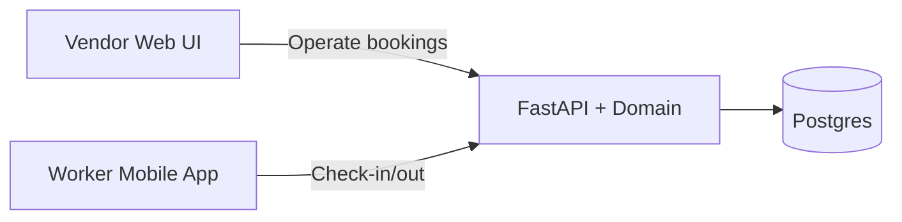
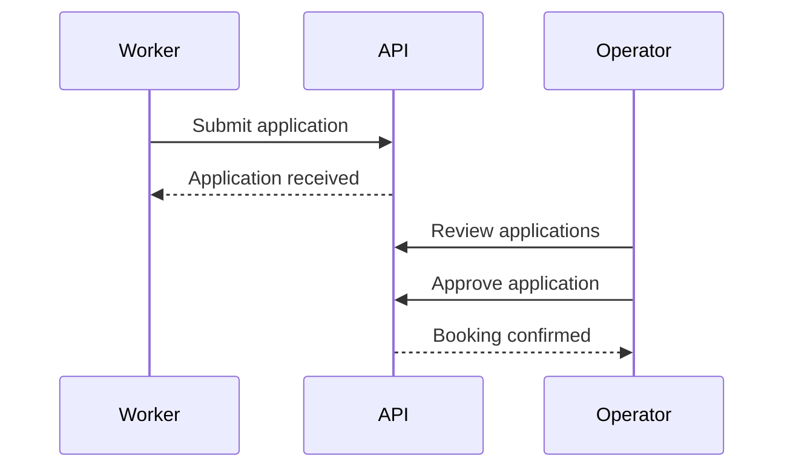
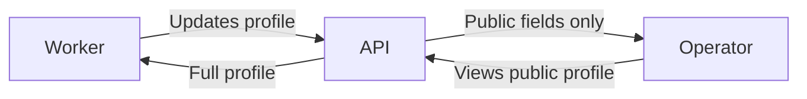

# On-Demand Event Staffing Platform
## Concept Overview (Authoritative)

## Executive Summary

This document outlines a proposed on-demand event staffing platform designed to address a persistent operational problem in hospitality and live events: sourcing reliable short-term staff quickly when demand exceeds internal capacity.

The concept is framed explicitly as an operations and systems problem, not a consumer marketplace. The platform prioritizes reliability, process control, accountability, and measurable outcomes over discovery, engagement, or social interaction.

This document serves as the upstream source of truth for MVP development and system design.

## Operational Problem Context

Hospitality groups, venue operators, and event management companies routinely experience staffing volatility driven by:

- Event-driven demand spikes
- Last-minute cancellations
- Seasonal variability
- Unexpected absences

These situations introduce operational risk, service degradation, managerial overhead, and revenue loss.

Existing solutions are fragmented and unreliable, including manual coordination, traditional staffing agencies, and informal worker pools that lack accountability or auditability.

## Target Operating Environment

The initial target environment includes restaurants, bars, clubs, and small-to-medium event venues.

The platform supports both single-venue operators and centralized management companies, emphasizing standardized workflows, repeatable processes, clear audit trails, and predictable outcomes.

## Core Insight

Event staffing is an operational reliability problem, not a talent discovery problem.

Operators require predictable fulfillment, reduced no-shows, time-bound commitments, clear accountability, and visibility across events and venues.

## Value Proposition

For venue operators:
- Faster shift coverage
- Reduced agency reliance
- Improved reliability
- Visibility into staffing performance

For workers:
- Clearly defined shifts
- Transparent pay
- Predictable settlement
- Professionalized temporary work

## Product Positioning

The platform is positioned as an operational staffing tool rather than a marketplace.

Positioning statement:
On-demand event staffing you can trust.

## UX & Workflow Design Principles

Venue-facing workflows prioritize speed and control.
Worker-facing workflows prioritize clarity and low friction.

Discovery-heavy interfaces are deliberately excluded.

## Client Roles & Surfaces

## Reliability & Risk Management

A reliability score is derived from objective data:
attendance, punctuality, completion, cancellations, and no-shows.

This score directly affects access to future shifts.

## MVP Scope & Constraints

In scope:
- Single city
- Single role
- Event-based staffing
- Shift posting
- Booking confirmation
- Attendance tracking
- Payments
- Reliability metrics

Out of scope:
- AI matching
- Discovery features
- Subscriptions
- Insurance integrations
- Multi-city rollout

## Go-To-Market & Validation

Initial deployment is hands-on and curated.
Operational correctness is prioritized over growth.

## Monetization

Revenue is generated via a percentage fee per completed booking.

## Scalability Considerations

Key considerations include booking consistency, idempotent payments, audit logging, and peak load handling.

Day-1 design choices that keep the system scalable without over-engineering:
- Modular monolith with clear domain boundaries so services can be split later.
- Explicit state transitions and idempotent writes for booking, attendance, and payment flows.
- Postgres as the source of truth with the option for read replicas and caching.
- Background workers for payouts, notifications, and reliability recomputations.
- Structured logging and basic metrics from the start.

## Open Questions

- Compliance and risk considerations
- Integration expectations
- Operator adoption barriers

## Application Flow (Worker to Operator)

## Shift Browsing (Worker View)

## Profile Visibility

## Worker Profile Fields

Public fields (visible to venues):
- display_name
- role
- city
- experience_years
- reliability_score
- badges
- bio
- languages

Private fields (visible only to worker):
- email
- phone
- address
- emergency_contact
- pay_rate
- notes
