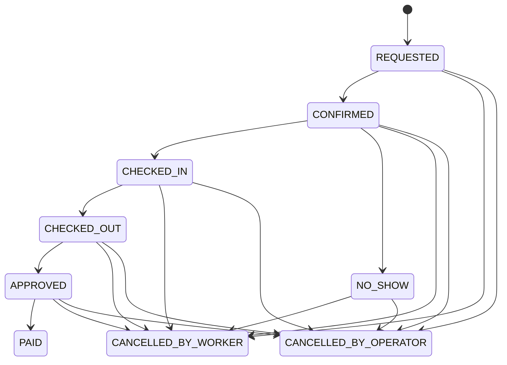

# State Machine Specification (Authoritative)

This document defines the ONLY valid states and transitions.
Any code violating this spec is incorrect.

## Booking States
- REQUESTED
- CONFIRMED
- CHECKED_IN
- CHECKED_OUT
- APPROVED
- PAID
- CANCELLED_BY_WORKER
- CANCELLED_BY_OPERATOR
- NO_SHOW

## State Diagram

## Allowed Transitions

| From | To | Actor | Conditions | Side Effects |
|----|----|----|----|----|
| REQUESTED | CONFIRMED | Operator | Shift open | Lock shift |
| CONFIRMED | CHECKED_IN | Worker | Within check-in window | Record time |
| CHECKED_IN | CHECKED_OUT | Worker | Checked in | Record duration |
| CHECKED_OUT | APPROVED | Operator | Hours valid | Freeze payment |
| APPROVED | PAID | System | Idempotent | Trigger payout |
| CONFIRMED | NO_SHOW | System | Check-in window expired | Reliability penalty |
| * | CANCELLED_BY_WORKER | Worker | Before start | Classify timing |
| * | CANCELLED_BY_OPERATOR | Operator | Any | Reopen shift |

## Invariants
- A booking may only be in ONE state at a time.
- PAID is terminal.
- CHECKED_IN requires CONFIRMED.
- CHECKED_OUT requires CHECKED_IN.
- NO_SHOW may only occur from CONFIRMED.

## Time Windows
- Check-in opens: start_time - 30 min
- Check-in closes: start_time + 15 min
