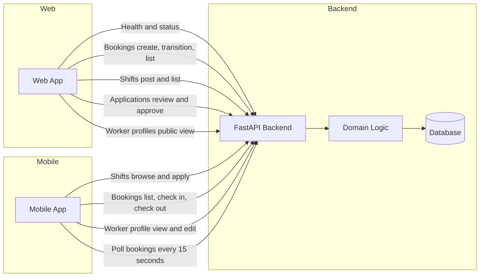

# API Flows (Backend, Web, Mobile)

This document summarizes the primary API flows between the backend, web app, and mobile app.

```mermaid
flowchart LR
  subgraph Backend
    API[FastAPI Backend]
    Domain[Domain Logic]
    DB[(Database)]
    API --> Domain --> DB
  end

  subgraph Web
    WebApp[Web App]
  end

  subgraph Mobile
    MobileApp[Mobile App]
  end

  WebApp -->|Health and status| API
  WebApp -->|Bookings create, transition, list| API
  WebApp -->|Shifts post and list| API
  WebApp -->|Applications review and approve| API
  WebApp -->|Worker profiles public view| API

  MobileApp -->|Shifts browse and apply| API
  MobileApp -->|Bookings list, check in, check out| API
  MobileApp -->|Worker profile view and edit| API
  MobileApp -->|Poll bookings every 15 seconds| API
```
