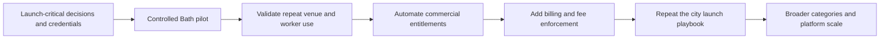

# Feature Status and Roadmap

This page is the shared product inventory. It says what a user can rely on today, what only has a foundation, and what remains a plan. Detailed implementation belongs in the linked domain and architecture documents.

## Product status by area

| Area | Status | What exists now | Material limitation or next step |
|---|---|---|---|
| Public website | Implemented | Home, worker, employer, download, safety and legal routes | Final brand, store links and launch copy remain open |
| Worker authentication | Implemented | Registration, login, password reset, email verification, logout, logout-all | Google/Apple sign-in is not implemented |
| Operator registration | Partial | Invite-gated registration atomically creates an organisation, venue, owner membership and user | Invite codes are environment values, not auditable partner entitlements |
| Account privacy | Implemented | Password-confirmed export, deactivation, anonymisation and session revocation | Operational privacy contacts and retention rules need final ownership |
| Organisation tenancy | Partial | Organisation, venue, membership and active venue data model; venue-scoped access checks | No membership-management or active-venue switching UI/API |
| Worker profiles | Implemented | Profile, photo, market, experience, languages and recontact choice | Verification credentials/background checking are not built |
| Shift publishing | Implemented | Create, edit, clone, close and cancel; multiple worker capacity; templates and recurring generation | Booked commercial terms are intentionally locked |
| Worker discovery | Implemented | Market-scoped cursor feed, search, timing/pay filters, pass state and map support | Ranking is rules/query based, not a learned matching system |
| Applications | Implemented | Apply, edit message/history, withdraw, approve and reject | No waitlist or bulk decision workflow |
| Bookings and attendance | Implemented | Confirm, check-in, check-out, approve, cancel and no-show lifecycle | No geofenced or manager-verified timeclock |
| Messaging | Implemented | Shift conversation tied to an application or booking; read state | No attachments, moderation console or real-time socket delivery |
| Notifications | Implemented | In-app, email and Expo push delivery with preferences, retries and dead letters | Production APNs/FCM/EAS credentials remain external setup |
| Ratings and reputation | Implemented | Bilateral post-shift ratings, summaries and worker reliability | Reputation policy, appeals and anti-gaming operations need ownership |
| Reports and disputes | Partial | Authenticated reporting, actor isolation and system review endpoints | No staff administration interface or case-management workflow |
| Earnings | Implemented as a view | Worker earnings aggregate completed/paid booking records | Not payroll, tax calculation or a bank payout ledger |
| Worker payment | Partial | Venue can record an external payment method, reference and authenticated recorder | The platform does not move money or calculate invoices/fees |
| Founding-partner offer | Planned | Approved design direction only | Persistence, redemption, entitlements, UI and commercial rules are unbuilt |
| Billing/subscriptions | Gap | An unmounted quote prototype exists in source | No mounted billing API, processor integration, invoices or fee enforcement |
| Media storage | Implemented | S3-compatible production storage and local development adapter; decoded/re-encoded images | Final production bucket/provider and lifecycle policy need configuration |
| Operations | Partial | Render blueprint, readiness, schema guard, Sentry hooks, worker health and runbook | Real alert ownership, backup retention and restore drill are external tasks |
| Automated quality | Implemented foundation | PostgreSQL and in-memory backend suites, migrations, web/mobile type checks, builds and container build | Load validation, native release testing and continuous security scanning remain |

## Roadmap by outcome

### Now: make the controlled pilot real

- Decide the legal operating model, contracting responsibility and payment responsibility.
- Confirm Bath, the first hospitality roles and venue types.
- Fix case-insensitive PostgreSQL email identity before public self-service registration.
- Configure production email, storage, Sentry, EAS/APNs/FCM, support and privacy contacts.
- Complete final web, iOS and Android device QA.
- Run load validation against the release candidate.

### Next: learn from the market

- Measure venue activation, time to first shift, application-to-booking conversion, fill rate, cancellation rate, show rate and repeat pairing.
- Run the founding-partner offer manually first, recording grants outside the product until rules are validated.
- Improve operator workflow from observed bottlenecks rather than adding speculative administration.
- Decide whether workers remain mobile-only for core flows.

### Then: automate what has proven useful

- Build founding-partner codes and organisation entitlements.
- Add billing plans, fee calculation, invoices and enforcement as a separate slice.
- Add organisation member invitations, permission management and venue switching.
- Add a small staff administration surface for reports, entitlements and support actions.
- Add Google and Apple sign-in after choosing managed identity versus custom OIDC.

### Later: expand deliberately

- Repeat the marketplace city by city once Bath demonstrates liquidity and repeat use.
- Add PostGIS when cross-city radius search becomes a real query requirement.
- Consider service decomposition only when independent scaling or team ownership justifies it.
- Consider Kafka only when durable replay and several independent event consumers are required.
- Expand beyond hospitality only after the initial marketplace model works.

## What should not be mistaken for progress

More screens, microservices or matching jargon do not create marketplace liquidity. The next valuable work is whatever reduces a measured failure in activation, fill, attendance, repeat use, safety or commercial collection. This is why the roadmap separates launch operations and market learning from platform-scale engineering.
