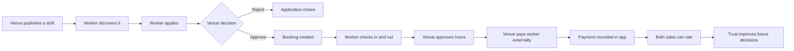
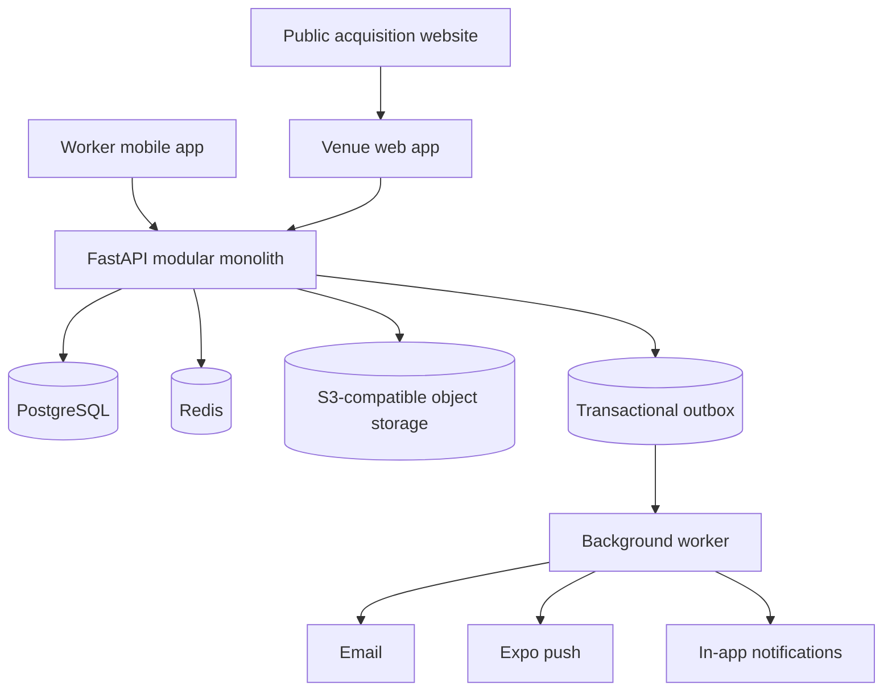

# Product Overview

## The product in one sentence

The app is a two-sided hospitality staffing marketplace: venues publish paid shifts through a web dashboard, workers discover and manage them through a mobile app, and the platform keeps the booking, attendance, communication, reliability and audit history consistent.

## Why it exists

Hospitality venues often need people at short notice, while workers want flexible local work with clear pay and expectations. The product reduces the coordination work between those two sides. It does not currently employ workers, run payroll, or move wages through a payment processor; venues pay workers outside the app and can record that fact against a completed booking.

The first market is intended to be Bath hospitality. Broader service categories and additional cities come after the initial marketplace has enough supply, demand and repeat use to work reliably.

## The people and organisations

| Actor | What they do | Current client |
|---|---|---|
| Worker | Builds a profile, browses shifts, applies, attends, messages, rates and tracks earnings | Expo mobile app |
| Operator | Represents a venue, publishes shifts, reviews applicants, manages attendance, records payment and rates workers | React web app |
| Organisation | Owns one or more venues and memberships | Backend model; limited UI/API management |
| Venue | The operational and data-isolation boundary for shifts and operator activity | Web dashboard and API |
| System actor | Runs controlled jobs such as no-show processing and report administration | Background worker/API-only |

## The core marketplace loop

Approval is deliberately atomic: the application approval, booking creation and shift-capacity update either all succeed or all fail. In plain language, two simultaneous clicks cannot legitimately create more bookings than the shift has spaces.

## Current product shape

The stack is intentionally a modular monolith rather than a collection of microservices. That means one backend deployment contains the API modules, but the code separates authentication, marketplace, trust, notifications and storage concerns. This is the right trade-off for a founder-built pilot: fewer moving parts, while keeping boundaries that can be split later if scale provides a real reason.

## What makes the product more than a job board

- Applications turn into capacity-controlled bookings rather than informal leads.
- A state machine controls attendance and completion, preventing impossible lifecycle jumps.
- Cancellations, withdrawals, payment attestations and ratings preserve the responsible actor and time.
- Venue and worker reputation are bilateral.
- Notifications are written through a durable outbox, so a database commit is not lost because email or push is temporarily unavailable.
- Organisation and venue boundaries prevent one customer from reading another venue's operational data.

These are useful foundations, not a complete commercial moat. Matching, messaging, ratings and fast shift booking are expected features in this market. The strategic differentiation still needs to come from local density, venue relationships, fair worker treatment, repeat teams and a clear commercial model.

## Launch boundaries

The current product is suitable for a controlled partner pilot after production credentials, legal decisions and final UI/device checks. It is not yet a self-serve national marketplace.

The largest non-code decisions are:

- the company's legal role in the worker/venue relationship;
- who employs and pays workers, and which costs the platform charges;
- the exact initial roles, venue types and launch geography;
- the founding-partner offer and normal fee shown beside it;
- the distribution route: private demo, controlled beta, or public app-store launch.

See [feature status and roadmap](feature-status-and-roadmap.md) for the evidence-based readiness view and [decisions and open questions](decisions-and-open-questions.md) for the discussion agenda.
