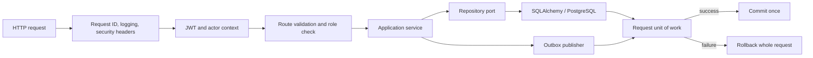
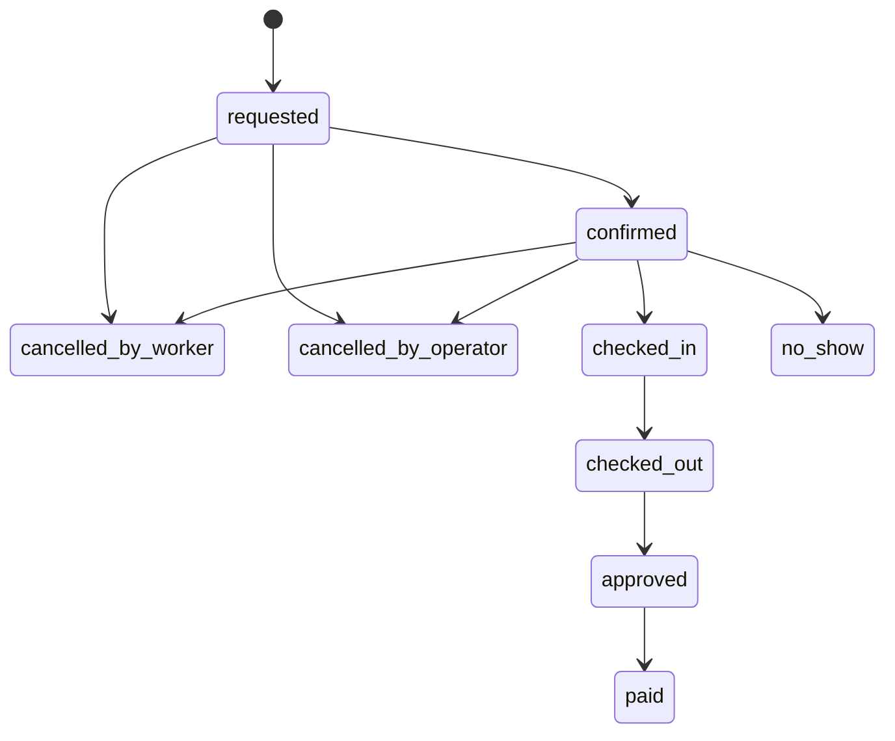

# Backend Architecture

## What the backend is responsible for

The FastAPI backend is the decision point for authentication, tenant isolation, marketplace rules, audit history, notification production and persistence. Clients may improve presentation, but they do not get to invent permissions or lifecycle transitions.

## Code structure

```text
apps/api/src/
├── routes/          HTTP endpoints and actor checks
├── services/        use cases and orchestration
├── repositories/    interfaces, in-memory fakes and SQLAlchemy adapters
├── db/              SQLAlchemy tables and schema guard
├── auth/            JWT, password and actor dependencies
├── storage/         local and S3-compatible adapters
├── jobs/            one-off background entry points
├── main.py          API composition root
├── worker.py        scheduled worker process
└── unit_of_work.py  request commit/rollback lifecycle

packages/domain/src/
├── booking.py
├── booking_state.py
├── booking_state_machine.py
└── reliability.py
```

## The normal command path



Routes use Pydantic schemas to reject malformed inputs. Services coordinate rules. Repositories hide the mechanics of querying and locking. A request-scoped database session commits once after the endpoint finishes; an exception rolls the request back.

This transaction boundary matters most during application approval. Booking creation, application status and `workers_filled` must describe the same reality. Row locking and database constraints protect that invariant when multiple requests arrive together.

## Domain state machine

The pure Python domain package owns legal booking transitions:



The old `docs/10-specs/state_machine_spec.md` shows cancellations from later states. That is historical and conflicts with the current domain code. Current code permits cancellation only from `requested` or `confirmed`.

The word `paid` means the venue has recorded an external payment attestation. It does not mean this platform transferred money.

## Repository strategy

Production uses SQLAlchemy repositories. In-memory repositories remain lightweight unit-test fakes and development aids; they are not expected to reproduce PostgreSQL locking, constraints or query behaviour. Endpoint, ownership, migration and concurrency tests therefore run against PostgreSQL.

## Idempotency

`POST /shifts`, `POST /applications`, and `POST /shifts/{shift_id}/messages` accept an optional `Idempotency-Key`. The server stores the actor, scope, key, request hash and completed response. A retry with the same key and request returns the same result; reusing the key for different input is rejected.

This protects mobile users from duplicate records when a network response is lost and the client retries. It is not a general cache and records expire.

## Error and request contracts

- FastAPI validation errors, HTTP errors, rate limits and unexpected failures use a stable error envelope.
- Every response receives an `X-Request-ID`; a safe caller-supplied ID may be preserved.
- Requests are logged as structured JSON containing method, path, status and duration.
- Production disables `/docs`, `/redoc` and the OpenAPI endpoint.
- `/health` and `/live` are shallow liveness checks. `/ready` checks database and Redis, then reports outbox/worker health as component detail.

## Background processing

The worker runs three schedules:

| Job | Schedule | Purpose |
|---|---|---|
| Outbox dispatch | Every 5 seconds | Fan out and deliver notifications |
| No-show sweep | Every 15 minutes | Mark expired confirmed bookings and update reliability |
| Recurring generation | Daily at 03:00 UTC | Generate upcoming shifts from active schedules |

Each job opens a fresh session. Outbox events use five-minute recoverable leases, exponential retry, eight attempts and dead-letter state.

## Deliberate limitations

- No WebSocket layer: message threads and several client surfaces poll.
- No distributed workflow engine: PostgreSQL and the worker are enough for current job volume.
- No mounted payment router: `routes/payments.py` is an isolated quote prototype only.
- No generic role/permission framework: roles are worker, operator and system, with organisation membership roles used for tenancy.
