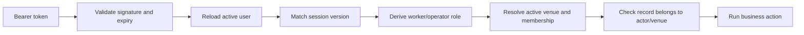
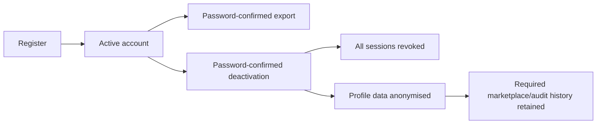

# Security and Privacy

## Security model in plain English

The backend distrusts the clients. A worker cannot become an operator by changing a mobile request, and one venue cannot gain access to another venue by changing an ID. The server reloads the user, derives the actor and tenant, checks ownership, and then performs the action inside a transaction.

**Status:** Strong pre-production foundation with completed internal red-team fixes. Public launch still requires production credentials, operational owners, legal classification, alert configuration and ongoing security maintenance.

## Identity and sessions

- Passwords are hashed through Passlib/bcrypt.
- Production requests use bearer JWTs.
- The database user record, not untrusted token role claims, determines the current role.
- A `session_version` allows logout-all and account deactivation to invalidate every existing token.
- Individual logout tokens are denied through shared Redis-backed revocation state in production.
- Email verification gates applications, messages, ratings, reports and uploads outside development.
- Password reset and email verification use rate-limited, purpose-specific tokens.

Development actor headers are accepted only when `DEV_MODE=true`. Production startup refuses development mode, in-memory repositories, short/default JWT secrets, SQLite, missing Redis and unsafe CORS settings.

## Authorisation and tenancy

Operator data is scoped by active `venue_id`; membership connects the user to the venue's organisation. Worker access is limited to the worker profile bound to the authenticated user. System-only endpoints require the system actor and are not available through ordinary user tokens.

## Abuse controls

Mutation-specific limits cover registration, login, password recovery, applications, shift creation, messages, payment attestations, ratings, reports, exports, deletion and uploads. Production uses Redis so all API replicas share the same counters.

Idempotency records protect retry-prone create operations. Input lengths, monetary bounds, cursor sizes and file characteristics are validated. Stable errors avoid leaking internal exception details.

## Upload safety

Uploaded JPEG, PNG and WebP images are decoded rather than trusted by filename or magic bytes. The pipeline:

1. checks the image header against a 40-million-pixel ceiling;
2. fully decodes the image;
3. corrects EXIF orientation;
4. downscales to a maximum 2048-pixel edge;
5. removes metadata;
6. re-encodes in the detected source format;
7. derives the stored extension and content type on the server.

Storage keys are actor/venue scoped. Replaced objects are retired after a successful database commit so rollback does not delete the still-referenced image.

## Browser and transport protections

The API emits request IDs, `nosniff`, frame denial, referrer and permissions policies. Production adds HSTS and a restrictive API content security policy. The Render static site adds its own HSTS, CSP, frame, content-type, referrer and permissions headers. Production CORS accepts explicit HTTPS origins only.

## Privacy lifecycle

Account deletion is implemented as deactivation plus anonymisation, preserving records required to understand bookings, reports and commercial history. Final retention periods and legal bases are business/legal decisions, not something the code can decide alone.

Reports support safety, harassment, payment, no-show, fraud and other categories. Access is isolated to the reporter; system actors can review and update status. A staff case-management UI is not implemented.

## Known issues and launch actions

- **Gap:** PostgreSQL email uniqueness is case-sensitive under the current schema/repository behaviour. Normalize identity and enforce case-insensitive uniqueness before public signup.
- **External setup:** production SMTP, object storage, Redis, Sentry, EAS/APNs/FCM and secret-store values.
- **Operations:** assign incident, privacy, support, backup and cloud account owners.
- **Legal:** confirm worker classification, contracting parties, retention, privacy notice and subprocessors.
- **Quality:** add dependency/container security reporting beyond existing audits and run regular credential/permission reviews.

The dated files under `docs/` remain useful audit history, but this page describes the current security posture.
