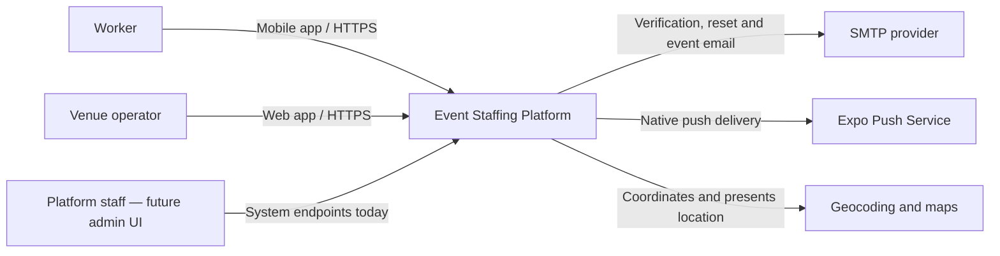
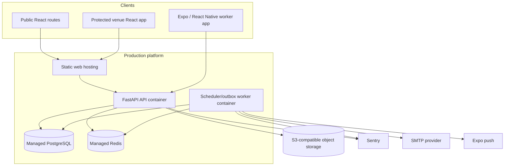
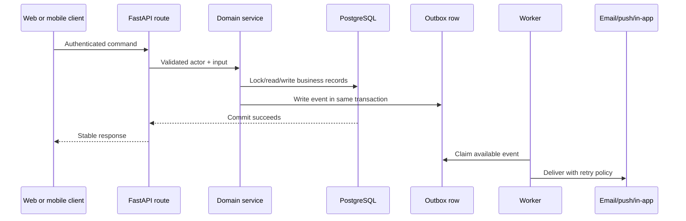

# System Architecture

## The architectural choice

The app is a modular monolith with three user-facing surfaces: a public/venue web app, a worker mobile app, and a FastAPI backend. A modular monolith is one deployable backend with internal boundaries. It avoids the cost of coordinating many services while preserving enough separation to scale or extract a module later.

**Status:** Implemented and appropriate for the Bath pilot. The system needs production configuration, validation and operational ownership, not a microservice rewrite.

## System context

## Deployable containers

PostgreSQL is the source of truth for marketplace and durable job state. Redis holds shared infrastructure state such as production rate limits, token revocation and worker heartbeat. Object storage holds processed images. The worker reads durable outbox events from PostgreSQL and delivers in-app, email and push notifications.

## Main boundaries

| Boundary | Owns | Why it is separate |
|---|---|---|
| Web client | Public acquisition and venue operations | Venue workflows benefit from a desktop dashboard |
| Mobile client | Worker discovery and shift management | Workers need native navigation, push and on-the-go interaction |
| API routes | HTTP validation, authentication and response contracts | Keeps transport concerns away from business rules |
| Services | Marketplace use cases and transaction orchestration | Makes business actions testable and reusable |
| Domain package | Booking states, transitions and reliability rules | Protects core invariants from framework changes |
| Repositories | Data access ports and SQLAlchemy adapters | Separates business actions from persistence details |
| Background worker | Outbox delivery, no-show sweep and recurring shifts | Slow/retryable work does not block API requests |

## Request and event paths

The event row is committed with the business change. If an email provider is down, the booking still commits and the notification remains retryable. Delivery is at-least-once, meaning a provider may very rarely receive a duplicate; in-app notification creation is deduplicated.

## Scaling path

The first scaling moves are deliberately ordinary:

1. Run stateless API replicas behind a load balancer.
2. Keep shared data in PostgreSQL, Redis and object storage.
3. Add/measure indexes and query plans for observed hot paths.
4. Run more outbox workers; `SKIP LOCKED` prevents them claiming the same row.
5. Add read replicas or caching only for measured read pressure.
6. Extract a service only when independent scaling, failure isolation or team ownership pays for the added complexity.

Kafka and Kubernetes are deferred. They solve real problems, but those problems are not present merely because the product intends to grow.

## Known constraints

- Production is a single-region design.
- The Render blueprint starts one scheduled worker; scheduler coordination would be required before running several scheduler instances.
- The staff actor has API capabilities for reports, but no staff administration UI.
- Organisation data supports multiple venues, while current operator UX behaves largely as one active venue.
- Processor payments and billing are outside the mounted application.

See [deployment and operations](../60-operations/deployment-and-operations.md) for runtime detail.
