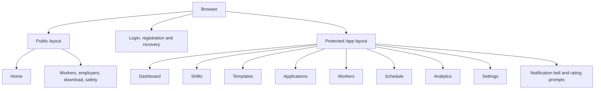
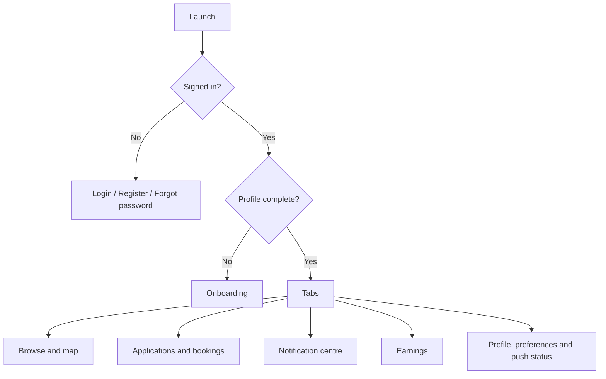

# Web and Mobile Architecture

The two clients serve different sides of the marketplace but share the same API and business rules. The web app is optimized for venue operations; the mobile app is optimized for workers moving between discovery, attendance and communication.

## Web application

**Stack:** React 18, TypeScript, Vite, React Router and Sentry.

Public routes provide acquisition and legal content. Authentication routes sit outside the dashboard. Venue operations live beneath `/app`; legacy top-level dashboard paths redirect to the protected equivalents.

The `AuthContext` owns the browser session and API client integration. Page components call a shared API wrapper. Notifications and rating prompts refresh in the background. Messages currently poll every five seconds.

### Web product consequence

Operators can run the venue from one desktop interface, but the current experience is primarily active-venue scoped. The database can support multi-venue organisations before the UI can manage memberships or switch the active venue.

## Mobile application

**Stack:** Expo SDK 54, React Native 0.81, React 19, TypeScript, React Navigation, Secure Store, Expo Notifications and React Native Maps.

The browse screen uses the server-side, market-scoped cursor feed. The shifts area refreshes its main data every 15 seconds while preventing overlapping polls. Message threads poll every five seconds. Native notification taps route to the relevant shift, application, booking or message.

Tokens are stored through Expo Secure Store rather than ordinary async storage. Push registration uses the native Expo modules and therefore requires a development/release build; remote delivery is not a reliable Expo Go test.

### Mobile product consequence

The app already covers the worker's core journey, including map discovery, earnings, notifications and post-shift ratings. The remaining launch risk is device/release configuration and QA, not the absence of a worker shell.

## Shared client rules

- The API is authoritative for permissions, tenant boundaries and state transitions.
- Currency and times come from server/market context; clients format rather than recalculate business truth.
- Clients show explicit empty, loading and error states.
- Notification actions carry an entity kind and ID so taps land on the relevant record.
- Public or documentation screenshots must use demo data only.

## Known gaps and trade-offs

| Topic | Current choice | Consequence |
|---|---|---|
| Real-time updates | Polling | Simpler deployment; more requests and slower updates than sockets |
| Worker web access | Mobile-first | Clear focus, but excludes workers who cannot install the app |
| Operator mobile access | Responsive web only | Avoids a second operator client; on-site workflows may be less convenient |
| Expo upgrade | SDK 57 deferred | Current app remains buildable, but dependency advisories cannot all be removed on SDK 54 |
| Multi-venue UX | Deferred | Backend isolation is ahead of operator controls |

## Screenshot catalogue

Screenshots should be added beneath `documentation/images/` after final UI polish and captured from demo accounts. Minimum useful set:

1. Public home page and employer proposition.
2. Venue dashboard with no personal account details visible.
3. Shift creation and application review.
4. Worker browse feed/map.
5. Worker booking and attendance controls.
6. Notification and rating prompts.

Each image caption should state client, route/screen, viewport/device, commit and whether the data is synthetic. The controlled filenames and privacy rules live in the [visual asset register](../images/README.md).
