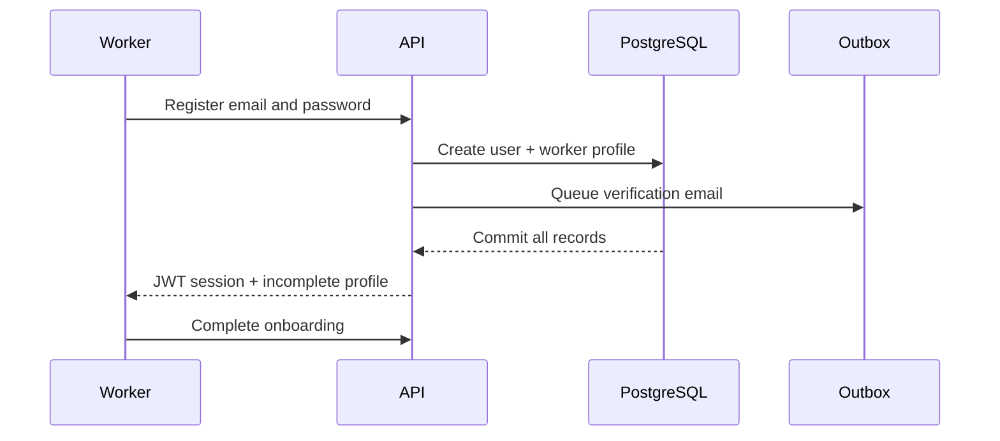
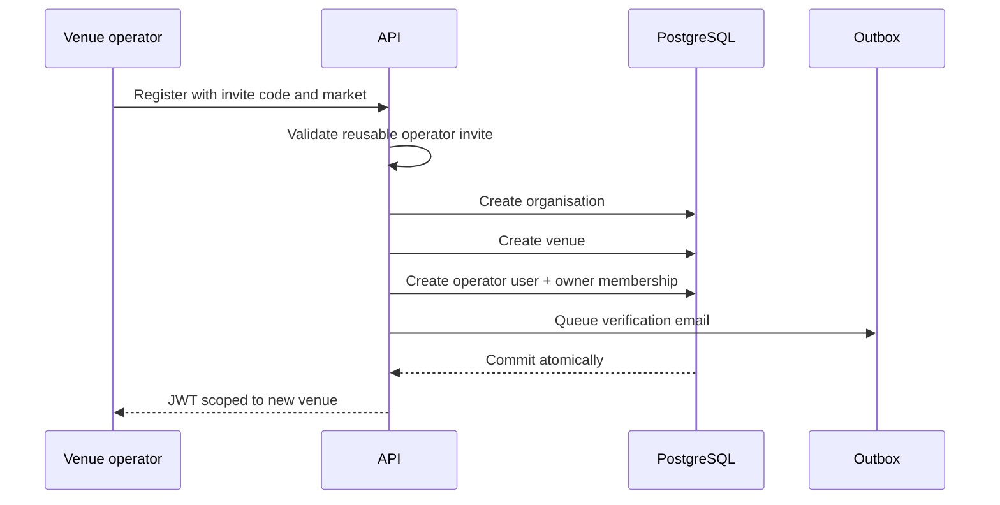
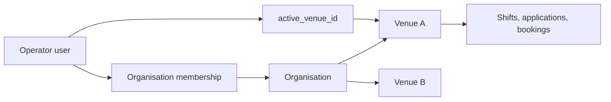

# Accounts, Identity and Tenancy

This domain answers three different questions: who is signed in, which organisation they belong to, and which venue's data they may act on. Keeping those concepts separate prevents a future multi-venue customer from becoming one shared, unsafe account.

## Account types

| Concept | Meaning |
|---|---|
| User | Login identity, password, role, session version and verification state |
| Worker profile | Marketplace identity and worker-specific details |
| Organisation | Commercial/legal customer group that can own venues |
| Venue | Operational tenant for shifts, applications, bookings and operator views |
| Membership | Connects an operator user to an organisation as owner, admin or manager |
| Active venue | The venue currently attached to an operator session |

`account_id` remains in parts of the code and API as a compatibility name for `venue_id`. New designs should use organisation and venue explicitly.

## Registration flows

If any database step fails, the whole registration rolls back. There is no valid state where the user exists but their organisation or venue does not.

## Authentication and session lifecycle

1. Login verifies the password and active account.
2. A JWT identifies the user and carries session context.
3. Every authenticated request reloads the active user and checks the token's session version.
4. Logout revokes one token. Logout-all increments the user session version and invalidates all older tokens.
5. Password change and account deactivation also make older sessions unusable.

Email verification is intentionally separate from authentication. An unverified person can sign in and finish basic setup, but production blocks actions that create marketplace or trust impact: applying, messaging, rating, reporting and uploading.

## Tenant isolation

Current operator queries and mutations use the active venue as their scope. A route may receive a record ID, but the service must still prove that the record's shift belongs to the operator's venue. Separate registrations produce separate organisations and venues.

## Privacy controls

- Account export requires the current password and a database-backed API.
- Deactivation requires the password, disables login, revokes sessions and anonymises personal profile data.
- Durable marketplace, report and payment-attestation history may remain where it is needed for audit or legal obligations.
- Avatar objects are retired only after the database commit succeeds.

The final retention policy, lawful bases and deletion exceptions require legal approval.

## Current gaps

### Case-insensitive email identity

The current PostgreSQL unique index treats differently cased strings as different values. Repository behaviour must normalize emails and the database must enforce the same identity rule before public signup. Otherwise `Name@example.com` and `name@example.com` could become separate accounts.

### Multi-venue management

The schema can represent several venues and memberships, but there is no complete API/UI for:

- inviting another operator;
- changing membership roles;
- removing a member;
- creating an additional venue;
- switching the active venue;
- organisation-wide analytics or billing.

This is acceptable for the single-venue pilot, but the distinction must not be hidden when onboarding a group.

### Operator invite codes are not partner entitlements

`OPERATOR_INVITE_CODES` is a reusable environment allow-list that gates operator registration. It has no persisted owner, expiry, redemption count, organisation grant or dashboard status. Founding-partner codes must be a separate feature; see [founding-partner entitlements](../80-future/founding-partner-entitlements.md).

## Production-readiness view

The account foundation is strong enough for a controlled pilot: transactions, session invalidation, verification, tenant checks, export and anonymisation are present and tested. It is not complete self-serve account infrastructure until case-insensitive identity, membership management, support administration and production identity-provider decisions are handled.
