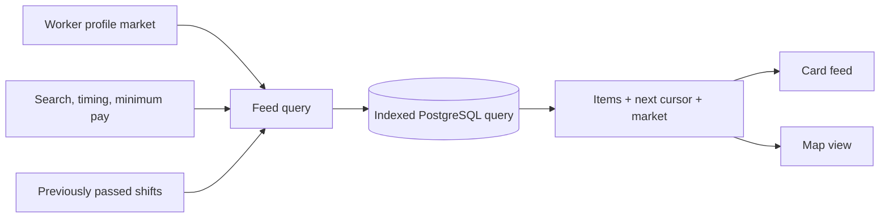
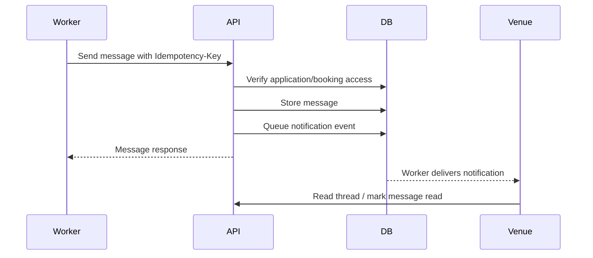

# Discovery, Communications and Trust

Discovery gets the right shifts in front of a worker. Communications help both sides coordinate. Trust features preserve enough identity and history to make informed choices and investigate problems.

## Worker discovery

The primary feed is `GET /workers/me/feed`. It is:

- scoped to the worker's active market;
- limited to open, future shifts with remaining capacity;
- filtered server-side by text, timing and minimum pay;
- ordered and paginated with a signed opaque cursor;
- bounded to 50 items per page;
- enriched with venue identity and market currency/timezone context.

Cursor pagination avoids the duplicate/skip problems that offset pages develop while shifts are being filled. A cursor is an encoded position, not a database ID the client can edit.

The current ranking is deterministic query logic, not machine learning. That is the honest starting point: there is not enough marketplace behaviour yet to train or validate a predictive matcher.

## Feed state

Workers can pass a shift, which stores a `worker_id + shift_id` state. They can remove that state to restore the shift. The database restricts the current action to `passed`; saved/favourite semantics are not part of this table.

## Messaging

Messages are tied to a shift and must also have an application or booking context. Access is therefore based on real marketplace participation rather than knowledge of a shift ID.

Clients poll message threads every five seconds. This is simpler than WebSockets and adequate for coordination, but it is not instant chat and creates repeated requests.

## Notifications

Notification events can fan out across in-app, email and push channels according to user preferences. The API exposes a paginated actor inbox, read/read-all actions, preferences and native device-token registration/revocation. Legacy worker-specific inbox endpoints remain for compatibility.

Action metadata sends taps to a shift, application, booking or message rather than a generic screen. The worker uses durable retry/dead-letter logic; see [events, storage and data lifecycle](../30-data/events-storage-and-data-lifecycle.md).

## Ratings and reputation

| Capability | Current behaviour |
|---|---|
| Worker rating | Venue rates worker after an eligible completed booking |
| Venue rating | Worker rates venue after an eligible completed booking |
| Duplicate prevention | One rating per booking per rater role |
| Integrity | Rater ID is stored and participation is checked |
| Visibility | Worker and venue summary endpoints expose aggregates |
| Prompting | Web and mobile periodically prompt for unrated completed work |

Generic mutual ratings are expected in the market; the value comes from using them fairly and transparently. The product still needs moderation, appeals and anti-retaliation policy.

## Safety reports

Verified workers and operators can report a venue, shift, application, booking or message under safety, harassment, payment, no-show, fraud or other. Reporters can view their own submissions. The system actor can list, review, resolve or dismiss reports.

**Partial:** the persistence and access controls exist, but staff need an administration interface, triage process, service level, escalation route and evidence policy.

## Strategic perspective

Discovery cards, messaging, ratings and notifications make the marketplace usable; they are not defensible by themselves. The more meaningful differentiators are likely to be local density, quality of venues, repeat teams, fair cancellation/payment policy and whether the marketplace helps good working relationships continue.
