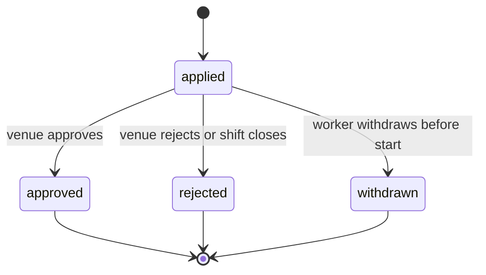
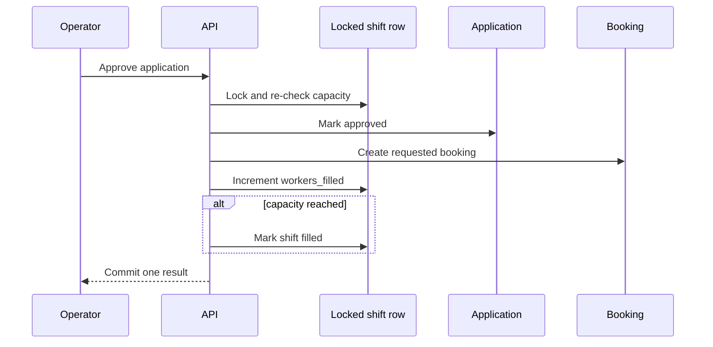
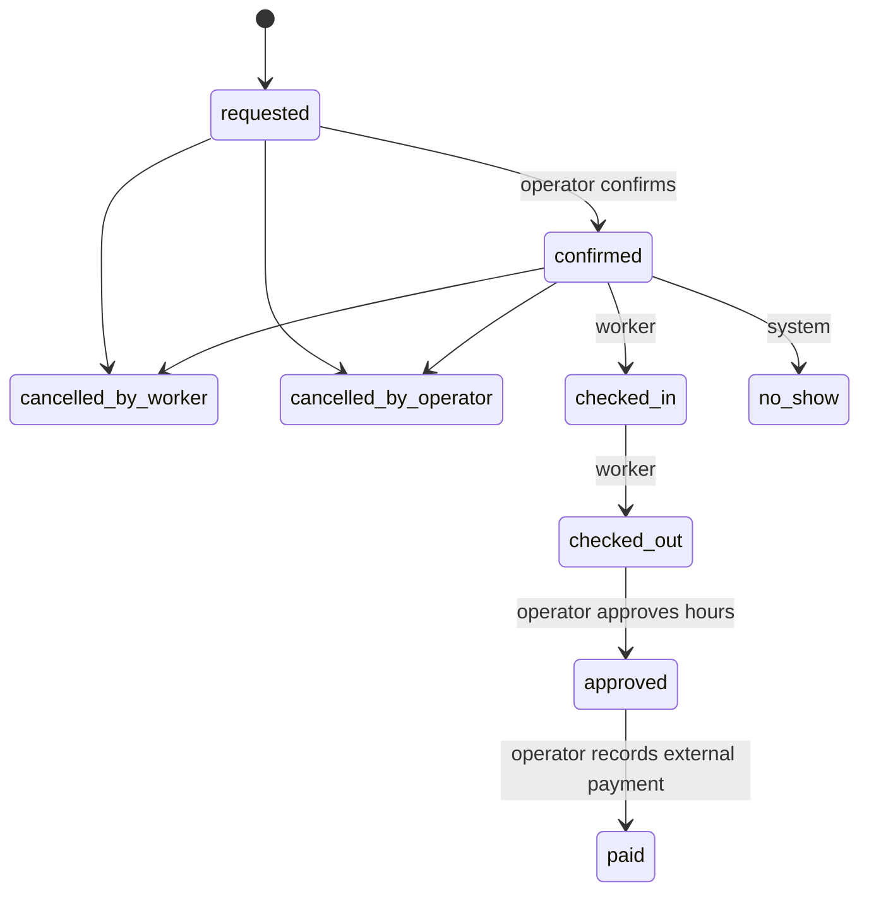

# Marketplace Lifecycle

The marketplace lifecycle turns a venue's staffing need into a recorded piece of completed work. Its rules protect capacity, contractual terms, attendance and accountability.

## Shift lifecycle

| Shift status | Meaning | Important rule |
|---|---|---|
| `open` | Accepting applications and has capacity | Visible to eligible workers |
| `filled` | Approved bookings use all places | New applications are blocked |
| `closed` | Venue stopped applications without cancelling booked work | Existing bookings remain |
| `cancelled` | Venue cancelled the shift before work began | Active bookings and pending applications are closed with reasons |

A venue can create, clone and edit shifts. Once an active booking exists, role, location, times and pay are locked; notes and capacity can still change within safe bounds. This prevents a venue from changing the agreed job after a worker is booked.

Closing rejects pending applications but preserves bookings. Cancelling requires a reason and authenticated actor, cancels requested/confirmed bookings, notifies workers and cannot proceed if any worker has already checked in or progressed further.

## Application lifecycle

A worker can apply once per shift. The application message can be edited only while pending; earlier text is retained in message history. Withdrawal requires a reason and is blocked after the shift starts.

Approval performs one capacity-controlled transaction:

PostgreSQL constraints prevent duplicate worker/shift applications and bookings. Row locking prevents concurrent approvals from oversubscribing capacity.

## Booking and attendance lifecycle

Only the server state machine may move a booking. Illegal jumps—such as `confirmed` directly to `paid`—fail.

### Cancellation and recovery

- Worker and operator booking cancellations require a reason and authenticated actor.
- Cancellation is legal only from `requested` or `confirmed`.
- Cancelling/no-show decrements filled capacity and can reopen a filled shift.
- The scheduled sweep marks confirmed bookings as no-show after the check-in window and refreshes worker reliability.
- Once attendance has started, recovery requires operational handling rather than rewriting history as a cancellation.

## Reliability and ratings

Reliability is recomputed from recorded booking outcomes, including no-shows. Ratings are separate subjective feedback. After a completed shift, both parties can submit one 1–5 star rating with an optional comment. The system records immutable rater identity and exposes worker and venue summaries to authenticated users according to each endpoint's role rules.

## Payment completion language

The final `paid` state records what the venue says happened outside the platform. It stores method, optional reference and the authenticated recorder. It is not processor confirmation, escrow, payroll or proof that funds settled. Product copy and reporting must keep that distinction explicit.

## Operational questions

- What evidence is required when a worker disputes attendance or payment?
- Who may correct a mistaken check-in/out or payment attestation?
- How are reliability and ratings appealed?
- When does a venue cancellation require compensation?
- Which lifecycle metrics trigger manual intervention during the pilot?

Those policies affect product behaviour and legal risk; they should be decided before automating exceptions.
