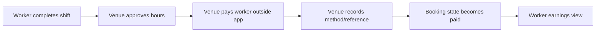
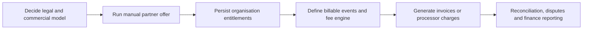

# Payments and Commercial Model

## What the app does today

The app does not process wages. After work is checked out and approved, an operator can record that the venue paid the worker externally. The booking stores:

- payment method;
- optional payment reference;
- payment timestamp;
- authenticated user who recorded it.

The worker earnings screen summarizes booking records. It is not a bank balance, payout ledger, payslip or tax statement.

## Why this distinction matters

Calling an attestation a processed payment would mislead workers, venues and auditors. The platform cannot confirm settlement, reverse funds, run payroll or reconcile a processor. Disputes must refer to the venue's evidence until a real payment integration exists.

## Current commercial direction

The proposed model is employer-paid:

- workers use the marketplace without a work-finding fee;
- venues fund worker wages and statutory employment costs;
- the platform may charge venues per completed booking, by subscription, for urgent promotion, or through a hybrid;
- direct hiring should be an explicit commercial path rather than treated as worker misconduct.

This direction is proposed, not yet enforced in code or contracts.

## Unmounted quote prototype

`apps/api/src/routes/payments.py` contains a fee-quote calculation for GB/AE card, bank-transfer and manual methods. The main FastAPI app does not mount this router. It is not a public contract, live Stripe integration or evidence of billing readiness.

Keeping the prototype unmounted is the safer choice until the legal/commercial model and rate cards are approved.

## Founding-partner offer

The intended offer waives the platform/service fee, not wages. A bounded combination of expiry and completed-shift cap is recommended, with the normal future price visible from day one. The first grants should be administered manually so real partner use can validate the rules before automation.

Technical design lives in [founding-partner entitlements](../80-future/founding-partner-entitlements.md).

## Billing capabilities that do not exist

- customer billing accounts;
- plans, subscriptions or invoices;
- usage metering for fees;
- entitlement enforcement;
- discounts and tax treatment;
- payment processor customers, mandates or webhooks;
- ledger, refunds, disputes or reconciliation;
- payroll, employer-of-record or worker payout infrastructure.

## Recommended implementation sequence

Entitlements and billing should remain separate. An entitlement answers “what benefit does this organisation have?” Billing answers “what should be charged, collected and reconciled?” Combining them makes manual grants and future pricing changes harder to audit.

## Decisions needed

- Who is the employer and contracting party for each shift?
- Is the venue fee per completed shift, subscription, hybrid or another model?
- Which statutory and payroll costs remain outside the platform fee?
- How is direct hiring priced, if at all?
- What happens when a venue records payment but a worker disputes receipt?
- When should the platform begin moving money, and which regulated responsibilities follow?
