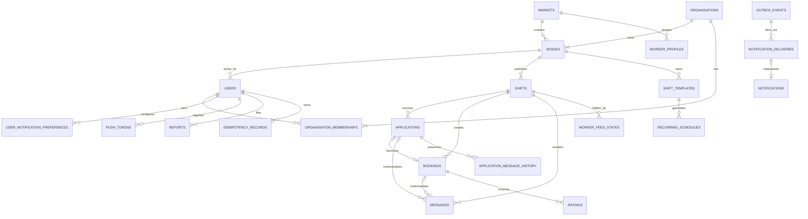

# Database Design

## Database role

PostgreSQL is the production source of truth. It stores marketplace state, tenant ownership, trust records, notification jobs and idempotency results. Redis and object storage support the system but do not replace PostgreSQL's durable business record.

**Current schema:** 29 ordered Alembic revisions, ending at `029_idempotency_records`.

## Conceptual schema

The diagram shows major relationships, not every column. Some historical actor fields such as `worker_id` and `operator_id` are string identifiers without database foreign keys; application services and ownership tests enforce their meaning. Future migrations should prefer explicit foreign keys where deletion/retention policy permits.

## Table catalogue

### Identity and tenancy

| Table | Purpose | Key integrity |
|---|---|---|
| `users` | Login identity, role, active venue, verification and session state | Unique email; active venue FK |
| `worker_profiles` | Worker-facing marketplace profile and reliability | Market FK; score/pay/experience checks |
| `markets` | Currency, timezone and launch-market configuration | Non-negative high-pay threshold |
| `organisations` | Commercial customer group | Stable organisation ID |
| `venues` | Tenant and operational venue profile | Organisation required; market optional |
| `organisation_memberships` | User role within organisation | Composite organisation/user key; owner/admin/manager check |

### Marketplace

| Table | Purpose | Key integrity |
|---|---|---|
| `shifts` | Published staffing requirement | Time, pay, capacity and status checks; venue FK |
| `applications` | Worker request for a shift | Unique worker/shift; status/time checks |
| `bookings` | Capacity reservation and attendance/payment lifecycle | Unique worker/shift; state enum; shift restricted from deletion |
| `shift_templates` | Reusable shift definition | Positive duration/capacity; venue FK |
| `recurring_schedules` | Scheduled template generation | Frequency/day/date checks; template cascade |
| `messages` | Application/booking conversation | Requires application or booking context |
| `application_message_history` | Previous application message text | Cascades with application |
| `worker_feed_states` | Worker-specific passed shifts | Composite worker/shift key; `passed` action only |

### Trust, notification and infrastructure

| Table | Purpose | Key integrity |
|---|---|---|
| `ratings` | Bilateral post-booking ratings | One per booking/rater role; stars 1–5 |
| `reports` | Safety/payment/fraud and other reports | Controlled subjects, categories and statuses |
| `notifications` | Materialized actor inbox | Venue/shift references clear safely on deletion |
| `outbox_events` | Durable events waiting for fan-out | Unique idempotency key; claim/retry fields |
| `notification_deliveries` | One event/channel/recipient attempt | Channel/status checks; unique delivery idempotency |
| `user_notification_preferences` | Channel and category choices | One row per user |
| `push_tokens` | Revocable native device registration | Unique token and user/device pair |
| `idempotency_records` | Safe API retry result | Unique actor/scope/key; request hash and expiry |

## Important invariants

Database checks act as the last line of defence even if a software bug reaches persistence:

- end time must be after start time;
- pay cannot be negative;
- shift capacity cannot fall below one or fill beyond required workers;
- application and shift statuses must be recognized values;
- one worker cannot apply or book twice for the same shift;
- a booking cannot outlive its shift through a destructive delete;
- ratings stay within 1–5 and each party rates once;
- report and delivery states are bounded;
- idempotency keys are unique per actor and operation scope.

## Index strategy

The launch query path is market-first:

- venues are indexed by market;
- open shifts are partially indexed by venue/start time;
- worker feed queries first narrow by market and timing, then apply search/pay filters;
- notification inboxes index actor, unread state and creation time;
- outbox and delivery tables index their next available work;
- idempotency expiry supports later cleanup.

Exact distance is calculated only after candidate narrowing. PostGIS/GiST is deliberately deferred until cross-city radius search becomes important.

## Transaction and concurrency strategy

The API uses one SQLAlchemy session per request and commits once. Application approval locks the relevant rows before checking capacity. Outbox events are inserted in the same transaction as the business change. Background workers claim batches with `FOR UPDATE SKIP LOCKED`, allowing safe parallel delivery without a central queue broker.

PostgreSQL integration tests prove rollback, cross-tenant isolation, approval capacity, idempotency races, outbox claims and storage/record ordering. In-memory fakes cannot prove these properties.

## Deletion and retention

- Shifts with applications or bookings are preserved rather than physically deleted.
- Closing/cancelling records reasons and timestamps instead of erasing history.
- Application withdrawal preserves the application.
- Account deactivation anonymises personal fields but retains necessary marketplace/audit history.
- Notification shift/venue references can be cleared without deleting the notification.
- Replaced object-storage files are retired after commit.

Retention duration and legal holds remain policy decisions.

## Migration history by capability

| Revisions | Capability introduced |
|---|---|
| 001–003 | Bookings, core marketplace tables and users |
| 004–009 | Multi-worker capacity, templates, messaging/history, integrity and feed state |
| 010–019 | Accounts, currency, media, notifications, ratings, coordinates, recontact, password and email verification |
| 020 | Time, money and deletion integrity |
| 021 | Organisation/venue separation and membership |
| 022 | Markets and worker-feed indexes |
| 023 | Immutable rating identity and role enforcement |
| 024 | Operational recovery and cancellation audit |
| 025 | Transactional outbox, deliveries, preferences and push tokens |
| 026 | Session-version revocation |
| 027 | Account privacy and reports |
| 028 | Direct-payment attestation |
| 029 | Idempotency records |

## Known schema work

- Enforce case-insensitive canonical email identity.
- Add partner codes and organisation entitlements only when the commercial rules are approved.
- Add billing tables as a separate model from entitlements.
- Add membership/active-venue operations before multi-venue self-service.
- Plan high-volume index creation/backfill strategies before production-scale migrations.
