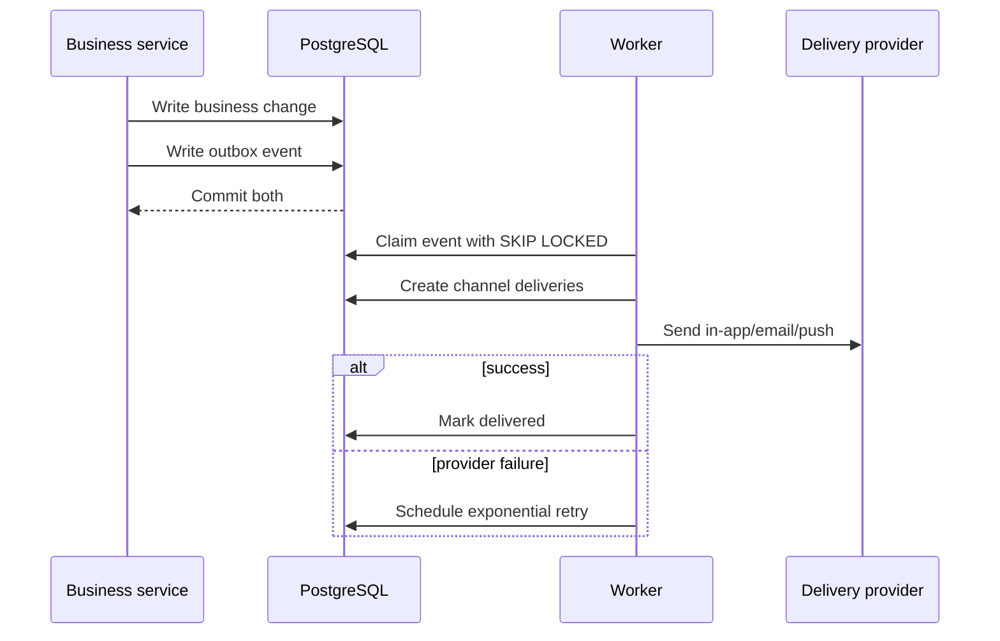
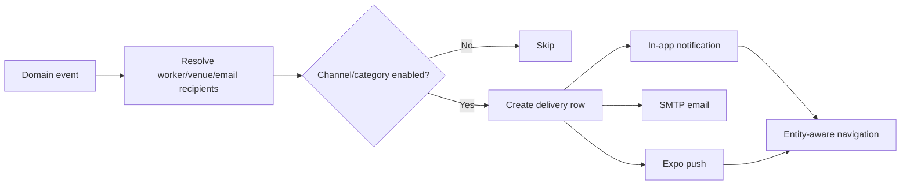
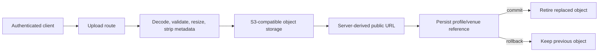

# Events, Storage and Data Lifecycle

This page covers data that moves outside the immediate request: notifications, background processing, image storage and lifecycle cleanup.

## Transactional outbox

An outbox solves a common failure: the database commits a booking, then email fails before it can be sent. Instead of sending during the request, the service writes an event row in the same database transaction.

### Delivery guarantees

- Event and business data are atomic.
- Worker claims have a five-minute recoverable lease.
- Retry delay grows exponentially from 30 seconds to a one-hour cap.
- Events/deliveries stop after eight attempts and enter dead-letter state.
- In-app delivery is idempotent through a unique delivery ID.
- SMTP and push are at-least-once; a crash after provider acceptance can create a duplicate.

The `/ready` component detail reports stale outbox events and dead letters, while Redis carries a worker heartbeat.

## Notification data flow

Push tokens are unique, device-associated and revocable. A logout can remove the current device registration. Production delivery still depends on Expo project, APNs and FCM credentials outside the repository.

## Object storage

Development may use the local filesystem adapter. Production refuses to use local storage and requires an S3-compatible bucket, endpoint, credentials and public base URL.

Supported image formats are JPEG, PNG and WebP. The server—not the client filename—decides the output type. Worker avatars, venue photos and venue avatars use actor-specific ownership and storage prefixes.

## Data classification

| Class | Examples | Handling expectation |
|---|---|---|
| Authentication | Password hash, tokens, session version | Never log secrets; store hashes/secure tokens; revoke promptly |
| Personal profile | Name, email, phone, address, emergency contact, photo | Limit access; include in export; anonymise/deactivate appropriately |
| Marketplace contract | Shift times, pay, application, booking and cancellation | Preserve history and actors; lock agreed terms after booking |
| Trust and safety | Ratings, reports, reliability, messages | Tenant/participant isolation; moderation and appeal policy |
| Commercial audit | Payment method/reference and recorder | Do not imply processor settlement; define retention |
| Operational telemetry | Request IDs, status, duration, errors | Avoid payload/secret logging; set retention in providers |

## Backup and recovery implications

The database and object bucket form one logical product record. Restoring only PostgreSQL can leave missing image objects; restoring only the bucket can leave orphaned objects. Production operations should enable database backups, bucket versioning/lifecycle rules and a joint restore drill.

The MVP recovery target is single-region rebuild, not automatic multi-region failover. The proposed runbook targets RTO under four hours and RPO under 24 hours, but these remain operational targets until hosting, retention and owners are configured and tested.

## Cleanup work

- Expired idempotency records need a scheduled cleanup policy.
- Revoked/stale push tokens need provider-error-driven retirement.
- Dead letters need an operator workflow, not only SQL inspection.
- Object lifecycle and orphan reconciliation need periodic checks.
- Data-retention durations need legal and commercial approval.
