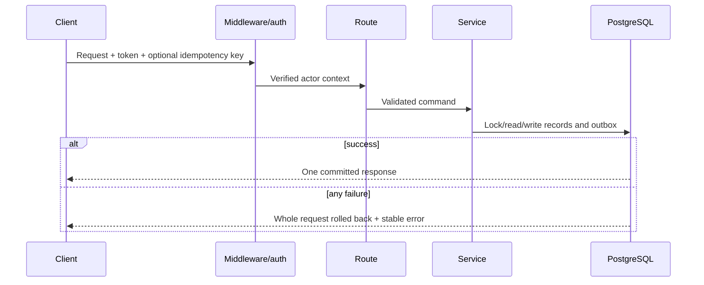

# API Design

## API role

The API is the product's policy boundary. It does more than pass database rows to clients: it identifies the actor, selects the venue/worker scope, validates input, runs lifecycle rules, commits once and produces durable events.

**Base style:** JSON over HTTPS, resource-oriented routes, bearer authentication in production, Pydantic request/response schemas.

## Authentication

Production clients send:

```http
Authorization: Bearer <access-token>
```

The server validates the signature/expiry, reloads the active user, checks `session_version`, derives the role and resolves organisation/venue membership. A token claim alone cannot elevate a user.

Development may use `X-Actor-Role`, `X-Actor-Id`, `X-Account-Id` and `X-Organisation-Id` only when `DEV_MODE=true`. These headers are not a production integration contract.

## Roles and scopes

| Role | Normal scope |
|---|---|
| Worker | Their bound worker profile, applications, bookings, messages and feed |
| Operator | Their active venue and records belonging to its shifts |
| System | Scheduled/admin actions explicitly marked system-only |

Some read routes accept both worker and operator but return data filtered to the caller. Knowing a resource ID never bypasses the ownership check.

## Requests

- IDs are strings and must be treated as opaque.
- Times are timezone-aware UTC timestamps at the API boundary.
- Money uses decimal validation and is stored as fixed-precision numeric data.
- List routes have bounded limits; the primary worker feed uses an opaque signed cursor.
- Mutations that can be duplicated by retry may accept `Idempotency-Key`.
- Cancellation and external-payment mutations require explicit confirmation fields/reasons.

Example retry-safe request:

```http
POST /applications HTTP/1.1
Authorization: Bearer <token>
Idempotency-Key: mobile-application-7f31
Content-Type: application/json

{
  "worker_id": "<current-worker-id>",
  "shift_id": "<shift-id>",
  "message": "I have two years of bar experience."
}
```

Reusing the same key with different JSON returns a conflict instead of silently creating a different record.

## Responses and errors

Successful endpoints return their declared Pydantic model directly. List endpoints usually return arrays; cursor endpoints return an object containing items and the next cursor.

Errors keep a compatibility `detail` field and a stable structured envelope:

```json
{
  "detail": "Request validation failed.",
  "error": {
    "code": "VALIDATION_ERROR",
    "message": "Request validation failed.",
    "details": [
      {
        "field": "pay_rate",
        "message": "Input should be greater than or equal to 0",
        "type": "greater_than_equal"
      }
    ]
  }
}
```

Stable codes include `BAD_REQUEST`, `AUTHENTICATION_REQUIRED`, `ACCESS_FORBIDDEN`, `NOT_FOUND`, `CONFLICT`, `PAYLOAD_TOO_LARGE`, `VALIDATION_ERROR`, `RATE_LIMITED` and `INTERNAL_ERROR`.

Every response receives `X-Request-ID`. Clients should include that ID in support reports; it connects the user-visible failure with structured API logs and Sentry.

## Pagination

The worker feed uses:

```text
GET /workers/me/feed?limit=20&cursor=...&query=bar&timing=weekend&minimum_pay=14
```

Response shape:

```json
{
  "items": [],
  "next_cursor": null,
  "market": {
    "market_id": "bath-gb",
    "currency": "GBP",
    "timezone": "Europe/London"
  }
}
```

The cursor is signed server state. Clients must not parse it and should discard it when filters change.

## Mutation guarantees



## Rate limits

High-risk/high-volume actions have specific limits, including login (5/minute), registration (10/hour), applications (10/minute), shift creation (20/hour), messages (30/minute), payment recording (10/hour), exports/deactivation (3/hour), ratings/reports/uploads and password flows. Production counters are shared through Redis.

Limits are abuse controls, not product quotas. Commercial usage caps should be modelled as entitlements or billing rules, not as IP rate limits.

## Versioning and compatibility

The API has no URL version prefix yet. Compatibility is maintained through response schemas and temporary aliases such as `account_id`/`/accounts/me` for venue concepts. Before opening the API to third parties, introduce an explicit compatibility/version policy and generated OpenAPI contract checks.

## Documentation exposure

FastAPI Swagger, ReDoc and OpenAPI JSON are available only in development. Production disables them to reduce unnecessary surface area. The [endpoint reference](endpoint-reference.md) documents mounted routes; `apps/api/src/routes/payments.py` is excluded because the app does not mount it.
