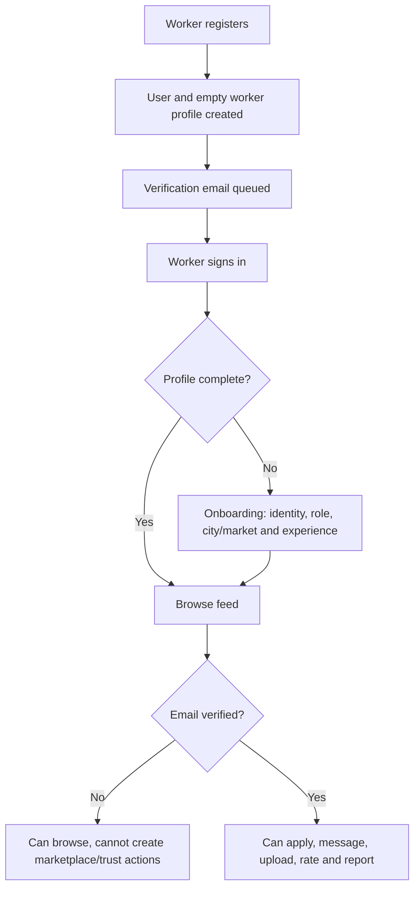
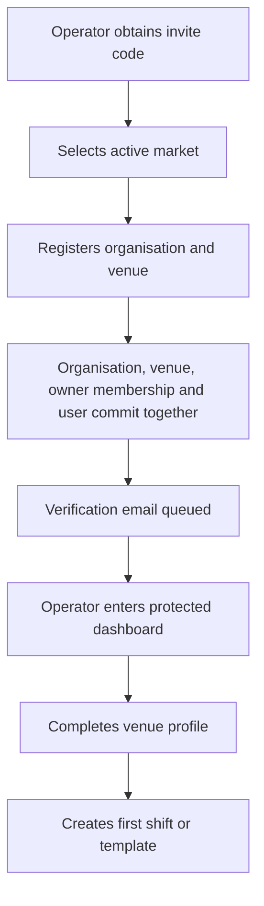
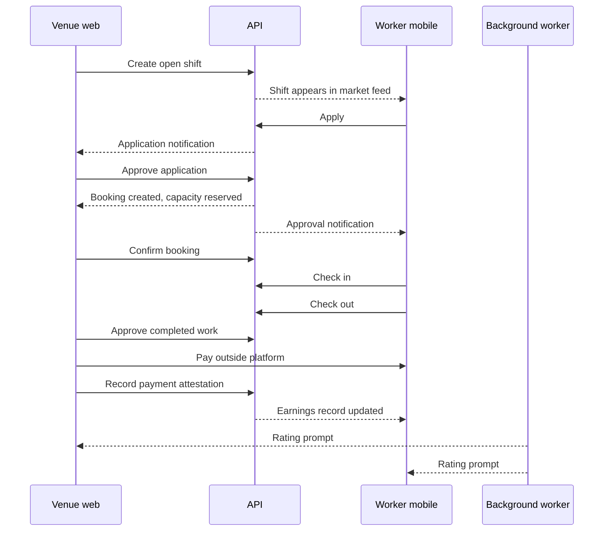
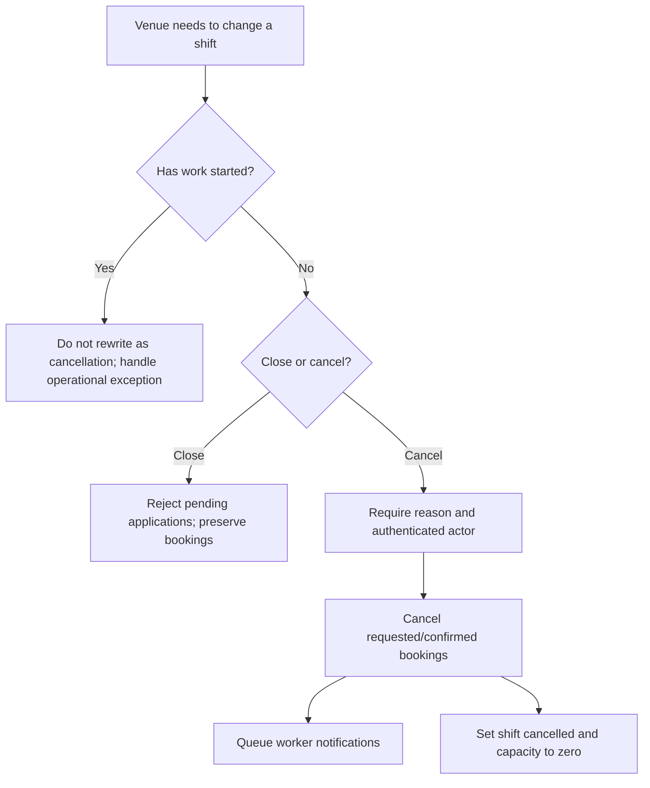
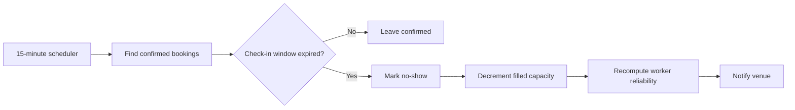
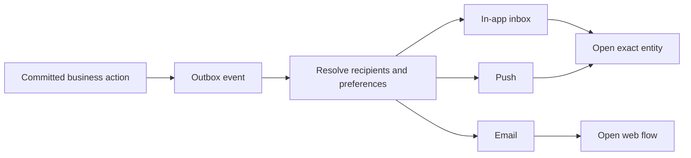
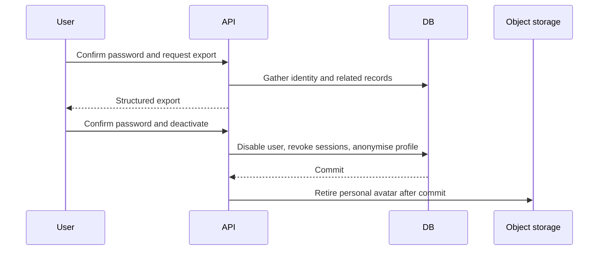
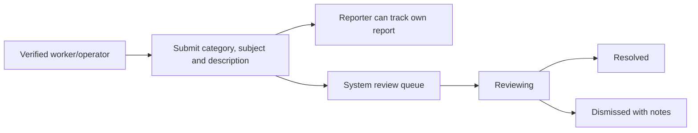

# End-to-End Flows

These flows show what people experience and where the system protects them. Detailed endpoint names are in the [endpoint reference](../40-api/endpoint-reference.md).

## Worker onboarding



## Venue onboarding



The invite only permits operator registration. It does not grant founding-partner pricing.

## Shift-to-payment journey



## Application decision under concurrency

```mermaid
sequenceDiagram
    participant O1 as Operator request A
    participant O2 as Operator request B
    participant DB as PostgreSQL shift row

    O1->>DB: Lock shift
    O2->>DB: Wait for lock
    O1->>DB: Approve and consume final place
    O1->>DB: Commit
    DB-->>O2: Lock acquired; capacity now full
    O2-->>O2: Reject with conflict/validation result
```

Without the lock, both requests could see one empty place and both approve. The database-backed flow prevents that race.

## Cancellation and closure



A worker may withdraw only a pending application before start. A booked worker may cancel only a requested/confirmed booking and must give a reason. The venue receives a durable notification.

## No-show processing



## Notification delivery



Provider failure does not roll back the original business action. The worker retries and eventually dead-letters repeated failures for investigation.

## Account export and deactivation



## Report and dispute flow



The API flow exists. Human triage ownership, evidence rules, response targets and a staff UI are still required.
