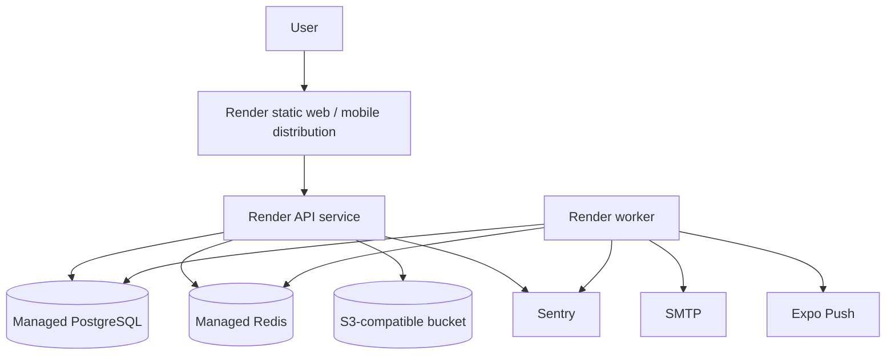

# Deployment and Operations

## Production topology

The checked-in Render blueprint provisions a static web site, Docker API service, Docker worker, managed PostgreSQL and managed Redis. S3-compatible storage, SMTP, Expo Push and Sentry are configured as external services.



The blueprint is a deployment starting point, not proof that production accounts, credentials or alert routes exist.

## Release process

1. Confirm CI is green for PostgreSQL/in-memory backend paths, web/mobile checks and container build.
2. Build one immutable API/worker image from the root `Dockerfile`.
3. Set required secrets in the production secret store.
4. Run `python -m alembic -c apps/api/alembic.ini upgrade head` as the pre-deploy command.
5. Let the API startup schema guard verify the expected revision.
6. Start the API and exactly one scheduled worker.
7. Verify `/live`, `/ready`, login, shift listing, application review, worker feed and one safe notification path.
8. Observe Sentry, platform logs and outbox health during rollout.

## Runtime commands

```text
API:    uvicorn apps.api.src.main:app --host 0.0.0.0 --port 8000
Worker: python -m apps.api.src.worker
```

The API does not start the scheduler. Do not add a second scheduled worker until job coordination/leader election is designed; outbox claiming can scale independently, but recurring/no-show schedules should not be duplicated casually.

## Health model

| Endpoint/signal | Meaning | Use |
|---|---|---|
| `/live` or `/health` | Process responds | Container liveness |
| `/ready` database | Database accepts a simple query | Remove unhealthy API from traffic |
| `/ready` Redis | Shared infrastructure responds | Required outside development |
| `/ready` outbox detail | Stale events/dead letters | Operational degradation signal |
| `/ready` worker detail | Redis heartbeat age | Detect stopped background worker |
| Sentry | Captured API/worker/web errors | Investigation and alerts |
| Structured logs | Request ID, path, status and duration | Request-level diagnosis |

Readiness currently returns success based on database and Redis; outbox/worker degradation appears in component detail. Monitoring must inspect those components rather than treating any HTTP 200 as fully healthy.

## Initial service targets

These are proposed pilot targets, not contractual SLAs:

- 99.0% monthly API availability;
- p95 under 800 ms for read endpoints and under two seconds for writes;
- fewer than 1% 5xx responses over 24 hours;
- no-show job delay under 60 minutes;
- business-hours incident acknowledgement within 30 minutes.

Do not promise these externally until measurement, staffing and escalation routes support them.

## Alerts to configure

- API 5xx or latency threshold breach.
- API/worker crash loop.
- Database or Redis connection failure.
- Schema migration/pre-deploy failure.
- Worker heartbeat older than 60 seconds.
- Oldest available outbox event older than five minutes.
- Any dead-letter delivery.
- Authentication/recovery traffic spike.
- Storage upload error rate or unexpected egress.

## Backup and disaster recovery

Production should combine managed PostgreSQL backups with object-storage versioning. The proposed single-region targets are:

- **RPO under 24 hours:** at most one day of data lost, matching daily backups.
- **RTO under four hours:** restore and redeploy within four hours.

These remain proposals until a real restore drill proves them. A quarterly staging restore should cover database, migrations, object references, authentication and one complete booking flow.

## Rollback

Prefer rolling the API/worker image back while leaving a backward-compatible schema in place. Database downgrade is a last resort because it can lose data. Every migration should be assessed for expand/contract compatibility before release.

After rollback verify:

- readiness and login;
- venue shift/application views;
- worker feed and bookings;
- outbox dispatch and inbox;
- upload URLs;
- schema version expected by the restored image.

## Incident response

Assign an incident owner, preserve logs, identify user impact and choose rollback, hotfix or monitoring. Credential leaks require immediate provider rotation, deployment of new values, session impact assessment and privacy review. User-facing incidents should record a timeline, root cause, scope, remediation and follow-up owner.

## Operational gaps

- Named product/engineering, on-call, cloud, backup, support and privacy owners.
- Configured alert delivery (Slack/PagerDuty/phone).
- Confirmed backup retention and tested restore.
- Production buckets, SMTP, Sentry and mobile credentials.
- Staff workflow for reports, dead letters and entitlement grants.
- Release tagging and a rehearsed app-store delivery path.
