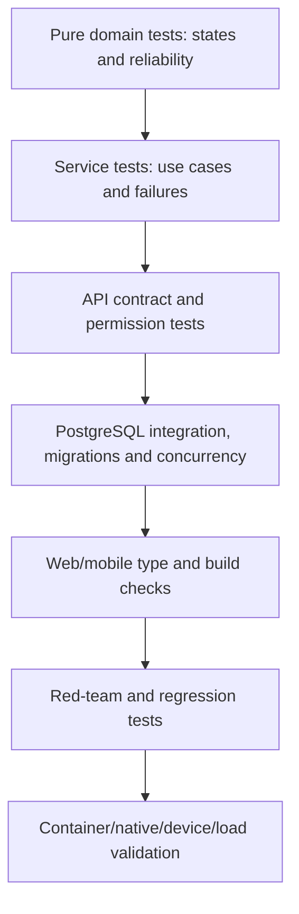

# Testing and Production Readiness

## Readiness verdict

The app has a strong engineering foundation for a controlled partner pilot. It is not yet ready for an unattended public launch or processor-based marketplace payments.

That distinction matters. Core marketplace correctness is well tested; several remaining blockers are identity edge cases, external production setup, legal/commercial decisions, operational ownership and native release validation.

## Evidence from the current branch

The latest recorded verification before this documentation change reported:

- 168 in-memory backend tests passed, with 44 PostgreSQL-only tests skipped by design;
- 204 PostgreSQL tests passed with zero skips;
- a complete Alembic base-to-029 rebuild passed;
- Python dependency consistency passed;
- web TypeScript and production build passed;
- mobile TypeScript and Expo SDK checks passed;
- focused Pillow upload processing passed;
- the repository diff check was clean.

Documentation-only changes do not alter those runtime results, but CI remains the authority for the final commit.

## Test layers

| Layer | What it proves | What it cannot prove alone |
|---|---|---|
| Domain | Legal booking transitions and reliability rules | HTTP auth, storage and database races |
| In-memory service/API | Fast business feedback and response behaviour | PostgreSQL constraints, transactions and locks |
| PostgreSQL integration | Ownership, rollback, migrations, capacity races, outbox/idempotency concurrency | Real provider credentials and device UX |
| Web checks | Type safety and production bundling | Cross-browser usability and live API behaviour |
| Mobile checks | Type safety and Expo dependency alignment | App-store build, permissions and push on real devices |
| Security regressions | Known exploit classes remain blocked | Unknown vulnerabilities and operating-process failures |
| Load/release | Capacity and production artifact behaviour | Marketplace/legal viability |

## CI pipeline

GitHub Actions runs:

1. backend twice, once with in-memory repositories and once requiring PostgreSQL tests;
2. Alembic migrations to head before tests;
3. Python dependency consistency;
4. web type check, build and high-severity production dependency audit;
5. mobile type check and critical production dependency audit;
6. production Docker image build.

The mobile audit threshold is currently less strict because Expo SDK 54 retains dependency advisories whose full resolution requires the separately planned SDK 57 upgrade.

## Readiness matrix

| Area | Status | Evidence | Remaining gate |
|---|---|---|---|
| Booking/application correctness | Ready for pilot | Domain, API, PostgreSQL and concurrency tests | Monitor real exception cases |
| Database migrations/integrity | Ready for pilot | Base-to-029 rebuild, constraints, rollback tests | Production backup and migration rehearsal |
| Authentication/session security | Conditional | JWT reload, revocation, verification, rate limits, red-team tests | Case-insensitive email identity; production secrets |
| Tenant isolation | Ready for single-venue pilot | Organisation/venue schema and cross-tenant tests | Multi-venue management before group self-service |
| Upload security/storage | Conditional | Decode/re-encode tests and S3 adapter | Production bucket, lifecycle and restore verification |
| Notifications | Conditional | Durable outbox concurrency/retry tests; clients wired | SMTP and native push credentials; alert/dead-letter ownership |
| Privacy/reporting | Conditional | Export, anonymisation and isolated reports | Legal retention, contacts and staff case process |
| Observability/operations | Conditional | Request IDs, Sentry hooks, readiness, worker heartbeat, runbook | Real alerts, named owners, restore drill |
| Web release | Conditional | Production build and public/protected routing | Final browser/accessibility/content QA |
| Mobile release | Conditional | Type/Expo checks and feature wiring | EAS/APNs/FCM, real-device QA and store path |
| Direct external payment record | Ready for pilot with clear wording | Authenticated attestation and idempotency tests | Dispute/evidence policy |
| Processor payments/payroll | Not ready | Not mounted/implemented | Legal model, provider integration, ledger and reconciliation |
| Billing/founding entitlements | Not ready | Design only | Commercial rules and implementation |
| Public legal launch | Not ready | Checklist/history only | Classification, contracts, policies and counsel approval |

## Launch gates

### Required for a controlled pilot

- Fix and migrate case-insensitive email identity.
- Confirm pilot terms, legal posture and who pays/employs workers.
- Configure production database, Redis, object storage, SMTP and Sentry.
- Configure EAS project, APNs and FCM; test push in release builds.
- Set support/privacy contacts and incident ownership.
- Verify backup and restore in staging.
- Complete worker and operator happy-path plus cancellation/dispute QA on real devices/browsers.
- Run a measured load test against feed, application approval and notification hot paths.

### Additional gates for public self-service

- Staff administration for reports/support and controlled operator onboarding.
- Membership/venue management or an explicit single-venue contract.
- Monitored service levels and escalation coverage.
- Final legal documents, data retention and subprocessors.
- Abuse, fraud, worker/venue verification and appeal processes proportional to launch risk.

### Additional gates for platform money movement

- Approved regulated/commercial model and contracting responsibilities.
- Provider customer/connected-account design, webhooks and idempotency.
- Double-entry or equivalent auditable ledger.
- Reconciliation, refunds, disputes and support operations.
- Tax, invoice and payroll responsibilities.

## Quality principles

- Test business invariants, not only lines of code.
- Use PostgreSQL for anything involving transactions, constraints or concurrency.
- Preserve known security findings as regression tests.
- Do not call an external setup “implemented” because code accepts a credential.
- Do not let a green build substitute for legal, product or operational readiness.
