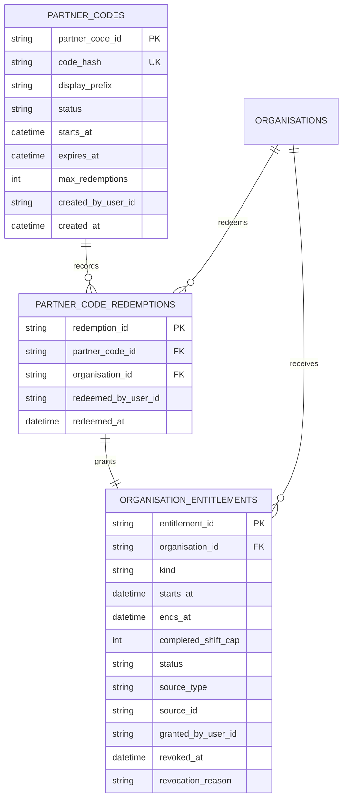
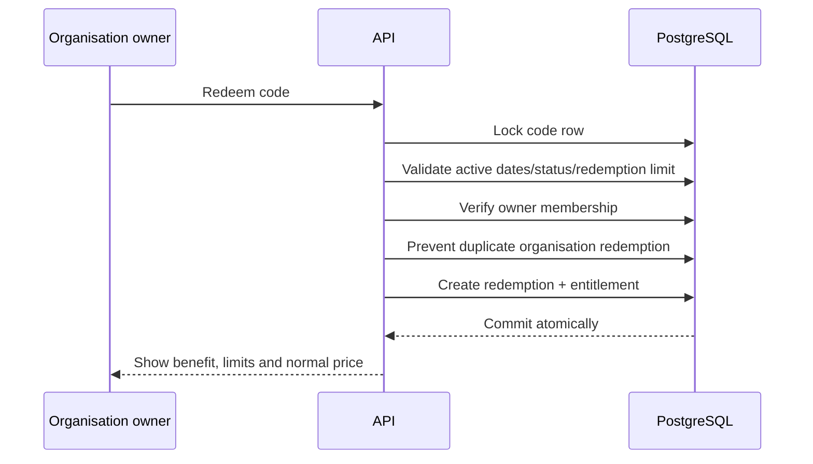

# Founding-Partner Entitlements

**Status:** Planned and deliberately deferred. No partner-code redemption or entitlement exists in the mounted product.

## Product intent

A founding partner should receive a clearly bounded organisation-level benefit—most likely no platform fee for a period and/or number of completed shifts. The venue still funds worker wages and applicable statutory costs.

The code must show the benefit on the organisation's account, preserve who granted/redeemed it, enforce expiry/redemption rules and remain separate from the operator-registration invite gate.

## Why this is not `OPERATOR_INVITE_CODES`

The current operator invite is an environment allow-list checked before registration. It is reusable, has no database record, no expiry, no redemption counter, no organisation owner and no dashboard status. Turning it into a discount mechanism would mix security admission with commercial benefits and make both harder to audit.

## Proposed model



Store a normalized code hash, not the full redeemable code. Show only a prefix/suffix for support. Manual grants use the same entitlement table with `source_type=manual`; they do not require a fake code redemption.

Usage should be derived from qualifying completed/paid bookings or written as explicit immutable usage records. A mutable `shifts_used` counter alone can drift after corrections.

## Redemption flow



Concurrent attempts must use row locks/unique constraints so a final redemption cannot be spent twice.

## Proposed interfaces

Initial delivery should avoid a staff web panel:

```text
python -m apps.api.scripts.create_partner_code ...
python -m apps.api.scripts.grant_organisation_entitlement ...
python -m apps.api.scripts.revoke_organisation_entitlement ...
```

Mounted owner-facing API when ready:

| Method | Path | Purpose |
|---|---|---|
| POST | `/partner-codes/redeem` | Owner redeems a code for the current organisation |
| GET | `/organisations/me/entitlements` | Read active, scheduled and expired benefits |

Do not expose staff create/revoke endpoints until a genuine staff authentication and audit plane exists.

## Account/dashboard presentation

Show:

- “Founding partner” status;
- exact start/end dates;
- completed-shift cap and current qualifying usage, if applicable;
- the normal platform fee that resumes after expiry;
- which venues are covered;
- expiry/usage warnings;
- support route for disputed status.

Avoid vague “free account” wording. The product should say “no platform fee” and explicitly state that wages and statutory costs remain payable.

## Abuse and security controls

- Normalize code input and compare hashes safely.
- Rate-limit redemption by actor and IP.
- Require verified operator identity and organisation-owner membership.
- Never accept organisation ID from the client without deriving/checking membership.
- Enforce code status, dates and count inside one transaction.
- Audit creator, redeemer, grant, extension, revocation and reason.
- Add PostgreSQL isolation/concurrency tests, not only in-memory tests.

## Relationship to billing

The entitlement may later tell a fee engine to apply a 100% platform-fee waiver. It must not calculate invoices itself. The billing engine owns billable events, rates, taxes, invoices and collection; the entitlement owns eligibility for a benefit.

## Business rules still required

- Offer duration.
- Completed-shift cap.
- Maximum redemptions per code.
- Organisation-wide versus selected-venue coverage.
- Normal fee displayed beside the offer.
- Extension/revocation authority and customer notice.
- Whether usage counts approved work, externally paid work, or another event.

Implementation should wait until these are agreed or deliberately parameterized.
