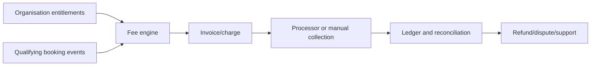
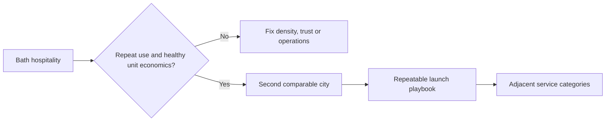

# Future Platform

This page keeps plausible future work visible without presenting it as current capability. Every item needs an evidence trigger; growth plans should not become an excuse for speculative infrastructure.

## Near-term platform work

| Capability | Why it matters | Trigger |
|---|---|---|
| Case-insensitive email identity | Prevent duplicate public identities | Before public signup |
| Founding-partner entitlements | Make pilot benefits visible and auditable | Partner rules validated manually |
| Organisation member/venue management | Support real multi-venue groups | First customer needs multiple operators/venues |
| Staff administration | Operate reports, support and grants safely | More cases than founders can handle via scripts |
| Expo SDK 57 migration | Reduce dependency risk and keep release tooling current | Dedicated regression window before public stores |
| Google/Apple sign-in | Reduce registration friction | Identity provider decision and measured auth drop-off |

## Commercial platform

This should follow, not precede, agreement on the company's legal role and fee model. A quote calculator is not billing infrastructure.

## Marketplace intelligence

The current feed is an indexed, deterministic market query. Future matching can incorporate:

- travel distance and transit constraints;
- role/skill evidence;
- availability and schedule conflicts;
- reliability and cancellation risk with fairness controls;
- venue/worker repeat preference;
- application and acceptance history;
- urgent fill and supply scarcity.

The trigger for learned ranking is enough clean outcome data to compare it with transparent rules. Avoid using protected or proxy characteristics, and provide understandable reasons for ranking decisions.

## Geographic expansion

PostGIS becomes useful when radius search spans many venues/cities and query plans show the need. Until then, market narrowing plus stored coordinates keeps the system simpler.

## Architecture evolution triggers

| Change | Reconsider when |
|---|---|
| More API replicas | Latency/throughput or availability requires horizontal capacity |
| More outbox workers | Delivery backlog grows despite provider health |
| Read replicas/cache | Measured read traffic pressures PostgreSQL |
| Separate service | A module needs independent scale, release/failure isolation or team ownership |
| Kafka/event streaming | Several independent consumers need durable replay/history |
| Kubernetes | Service fleet and deployment constraints justify a cluster control plane |
| Multi-region | Contractual availability or expansion makes single-region recovery insufficient |

## Product expansion candidates

- Repeat/favourite teams and venue talent pools.
- Better availability and conflict management.
- Worker credentials and verified skills.
- Direct-hire conversion workflow.
- Shift promotions and urgent fill tools.
- Subscriptions and organisation billing.
- Broader local-service listings after hospitality works.

Each candidate should state the user problem, expected metric movement, legal/safety impact and simplest test before engineering begins.

## Decisions that should remain reversible

- Payment provider until processor requirements are known.
- Managed versus custom identity until auth needs are measured.
- Object-storage provider behind the S3-compatible adapter.
- Hosting provider while containers, PostgreSQL and Redis remain portable.
- Matching algorithm until marketplace data can validate it.

The durable choices are domain history, tenant isolation, auditable actions and clear contracts. Provider choices should stay replaceable where the cost is reasonable.
